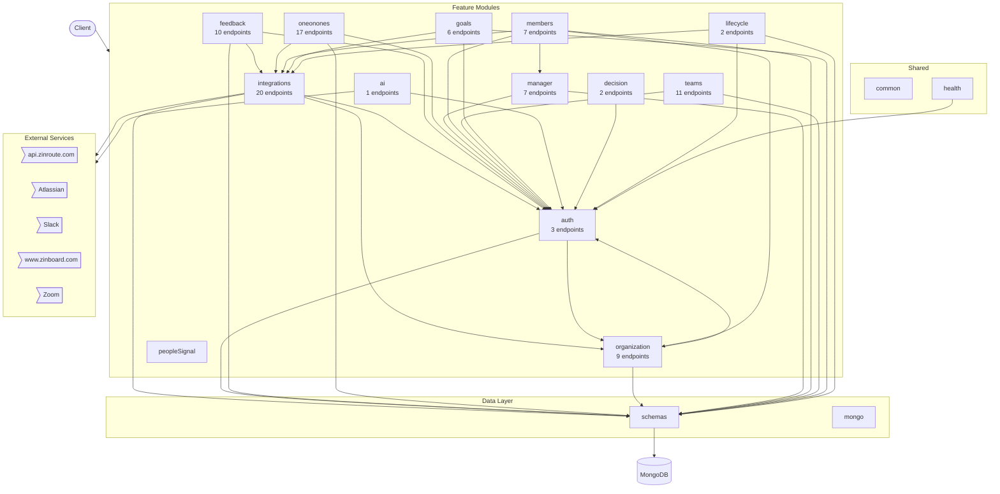
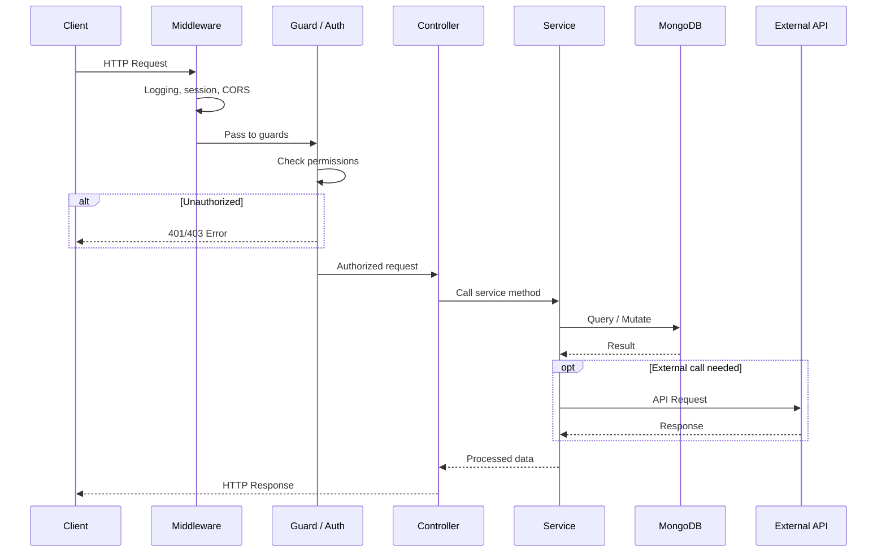
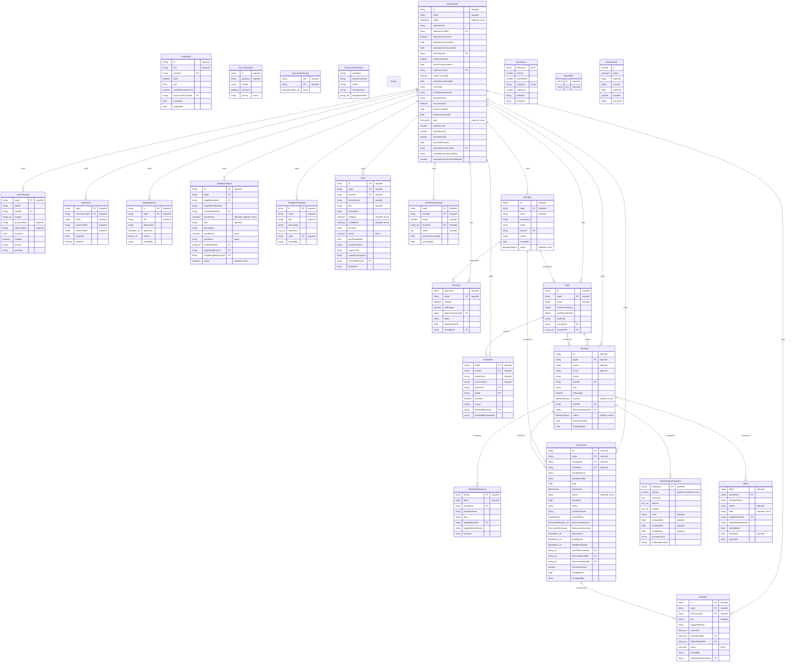
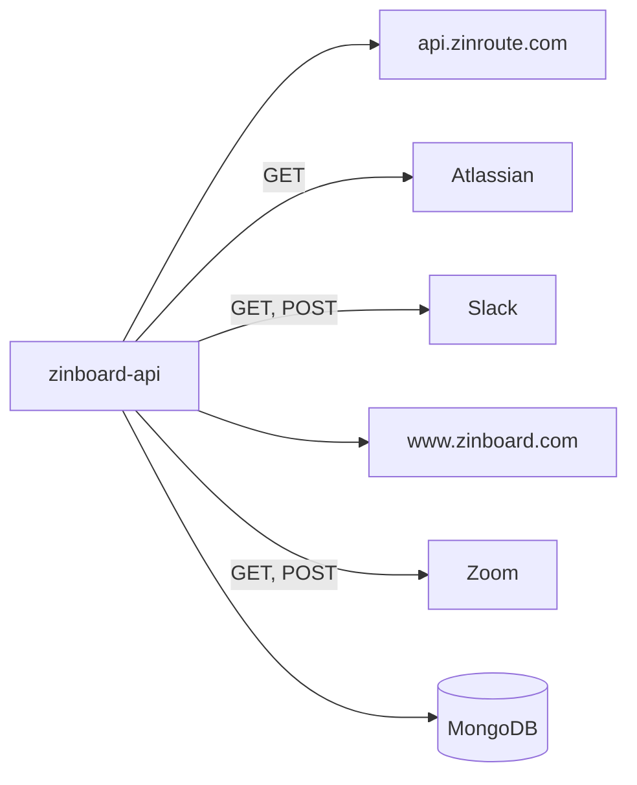

# zinboard-api

*Auto-generated by [zinsight](https://github.com/zinboard/zinsight) on 2026-04-19*

## What This App Does

This is a **backend API service** built with **Express, NestJS** that enables users to conduct 1:1 meetings, collect and manage feedback, track goals, manage teams, manage team members, leverage AI-powered insights, and track decisions.

The codebase follows a **modular, controller-service, guard-protected, schema-driven** architecture — each feature is a self-contained module with clear separation between HTTP handling (controllers), business logic (services), and data access (schemas).

### Core Capabilities

- **User authentication and authorization** — 3 endpoints
- **Feedback collection and management** — 10 endpoints
- **1:1 meeting management** — 17 endpoints
- **Manager-specific features** — 7 endpoints
- **Member/user management** — 7 endpoints
- **Team management** — 11 endpoints
- **Goal tracking and management** — 6 endpoints
- **AI-powered features and generation** — 1 endpoint
- **Decision tracking** — 2 endpoints
- **Data export**

### Integrations

- Third-party integrations
- Webhook handling

### Infrastructure

- App lifecycle management
- Health check endpoints

In total, the system exposes **98** API endpoints, **26** data models, **20** modules.

**Connects to:** **MongoDB** for data storage · **Slack** for messaging · **Zoom** for video conferencing · **Atlassian/Jira** for project management

## Overview

| **125** files · **18,861** lines of code · **20** modules · **98** API endpoints · **26** data models · MongoDB |
|---|

**Project docs:** [Description](README.md)

## Table of Contents

- [What This App Does](#what-this-app-does)
- [Overview](#overview)
- [Tech Stack](#tech-stack)
- [Architecture](#architecture)
- [Modules](#modules)
- [API Endpoints](#api-endpoints)
- [Database](#database)
- [External Integrations](#external-integrations)
- [Environment Variables](#environment-variables)
- [New Developer Guide](#new-developer-guide)

## Tech Stack

| Category | Technologies |
|----------|-------------|
| **Runtime** | Node.js |
| **Languages** | TypeScript, JavaScript |
| **Frameworks** | Express, NestJS |
| **Databases** | MongoDB, MongoDB (Mongoose) |
| **ORM / Data Layer** | Mongoose, NestJS Mongoose |
| **HTTP Clients** | node-fetch |
| **Authentication & Security** | bcrypt |
| **Testing** | Jest, SuperTest |
| **Build & Dev Tools** | ESLint, Prettier, SWC, TypeScript |
| **Other Notable** | Nodemailer, RxJS, UUID, class-transformer, class-validator, dotenv |

## Architecture



### Request Lifecycle



## Modules

| Module | Purpose | Files | Lines |
|--------|---------|-------|-------|
| **schemas** | Database models & schemas | 18 | 1,329 |
| **integrations** | External service integrations (20 endpoints) | 15 | 4,760 |
| **auth** | Authentication & authorization (3 endpoints) | 13 | 848 |
| **feedback** | Feature module (API + business logic) (10 endpoints) | 10 | 945 |
| **oneonones** | Feature module (API + business logic) (17 endpoints) | 10 | 1,605 |
| **organization** | Feature module (API + business logic) (9 endpoints) | 7 | 1,111 |
| **manager** | Feature module (API + business logic) (7 endpoints) | 6 | 565 |
| **members** | Feature module (API + business logic) (7 endpoints) | 6 | 757 |
| **teams** | Feature module (API + business logic) (11 endpoints) | 6 | 666 |
| **goals** | Feature module (API + business logic) (6 endpoints) | 5 | 605 |
| **ai** | Feature module (API + business logic) (1 endpoints) | 4 | 2,381 |
| **common** | Shared utilities & helpers | 3 | 107 |
| **decision** | Feature module (API + business logic) (2 endpoints) | 3 | 198 |
| **lifecycle** | Feature module (API + business logic) (2 endpoints) | 3 | 220 |
| **peopleSignal** | Business logic / services | 3 | 197 |
| **health** | Health check endpoints (1 endpoints) | 2 | 31 |
| **mongo** | Database connection setup | 2 | 142 |

## API Endpoints

### Oneonones — `src/oneonones/oneonones.controller.ts`

🟢 GET 🔵 POST 🔴 DELETE 🟠 PATCH · 17 endpoints

| Method | Path | Handler |
|--------|------|---------|
| 🟢 GET | `/oneonones` | `list` |
| 🔵 POST | `/oneonones` | `create` |
| 🔴 DELETE | `/oneonones/:id` | `remove` |
| 🟢 GET | `/oneonones/:id` | `get` |
| 🟠 PATCH | `/oneonones/:id` | `update` |
| 🔵 POST | `/oneonones/:id/action` | `addAction` |
| 🔴 DELETE | `/oneonones/:id/action/:actionId` | `deleteAction` |
| 🟠 PATCH | `/oneonones/:id/action/:actionId` | `toggleAction` |
| 🔵 POST | `/oneonones/:id/complete` | `complete` |
| 🔵 POST | `/oneonones/:id/decision` | `decision` |
| 🔵 POST | `/oneonones/:id/notes` | `addNote` |
| 🟢 GET | `/oneonones/:id/suggested-topics` | `suggestedTopics` |
| 🔵 POST | `/oneonones/:id/zoom` | `createMeeting` |
| 🟢 GET | `/oneonones/action-items` | `actionItems` |
| 🔵 POST | `/oneonones/confluence` | `saveToConfluence` |
| 🟢 GET | `/oneonones/coverage-gaps` | `coverageGaps` |
| 🟢 GET | `/oneonones/sentiment/:memberId` | `sentimentHistory` |

### Atlassian — `src/integrations/atlassian/atlassian.controller.ts`

🔴 DELETE 🟢 GET 🔵 POST · 11 endpoints

| Method | Path | Handler |
|--------|------|---------|
| 🔴 DELETE | `/atlassian` | `disconnect` |
| 🟢 GET | `/atlassian/auth/me` | `me` |
| 🔵 POST | `/atlassian/folders` | `createFolders` |
| 🔵 POST | `/atlassian/jira/stats` | `getJiraStats` |
| 🔵 POST | `/atlassian/jira/stats-raw` | `getJiraStatsFromRawData` |
| 🟢 GET | `/atlassian/jira/users` | `fetchUsers` |
| 🔵 POST | `/atlassian/logout` | `logout` |
| 🟢 GET | `/atlassian/oauth/callback` | `oauthCallback` |
| 🟢 GET | `/atlassian/oauth/init` | `initOAuth` |
| 🔵 POST | `/atlassian/verify-board` | `verifyBoard` |
| 🔵 POST | `/atlassian/verify-space` | `verifySpace` |

### Team — `src/teams/team.controller.ts`

🟢 GET 🔵 POST 🔴 DELETE 🟠 PATCH · 11 endpoints

| Method | Path | Handler |
|--------|------|---------|
| 🟢 GET | `/teams` | `list` |
| 🔵 POST | `/teams` | `create` |
| 🔴 DELETE | `/teams/:id` | `remove` |
| 🟢 GET | `/teams/:id` | `get` |
| 🟠 PATCH | `/teams/:id` | `update` |
| 🔵 POST | `/teams/:id/add-member` | `addMember` |
| 🔵 POST | `/teams/:id/assign-manager` | `assignManager` |
| 🟢 GET | `/teams/:id/members` | `members` |
| 🟢 GET | `/teams/:id/members/stats` | `membersWithStats` |
| 🔵 POST | `/teams/:id/remove-member` | `removeMember` |
| 🟢 GET | `/teams/manager` | `listForManager` |

### Organization — `src/organization/organization.controller.ts`

🟢 GET 🔴 DELETE 🟠 PATCH 🔵 POST · 9 endpoints

| Method | Path | Handler |
|--------|------|---------|
| 🟢 GET | `/organizations` | `list` |
| 🔴 DELETE | `/organizations/:id` | `remove` |
| 🟢 GET | `/organizations/:id` | `get` |
| 🟠 PATCH | `/organizations/:id` | `patch` |
| 🔴 DELETE | `/organizations/:id/data` | `purgeData` |
| 🔵 POST | `/organizations/:id/disconnect` | `disconnectOrg` |
| 🟢 GET | `/organizations/:id/export` | `exportData` |
| 🔴 DELETE | `/organizations/:id/llm-config` | `removeLlmConfig` |
| 🔵 POST | `/organizations/:id/llm-config` | `saveLlmConfig` |

### Feedback — `src/feedback/feedback.controller.ts`

🟢 GET 🔵 POST · 7 endpoints

| Method | Path | Handler |
|--------|------|---------|
| 🟢 GET | `/feedback/forms` | `listForms` |
| 🔵 POST | `/feedback/forms` | `createForm` |
| 🟢 GET | `/feedback/forms/:id` | `getForm` |
| 🟢 GET | `/feedback/forms/:id/responses` | `listResponses` |
| 🔵 POST | `/feedback/forms/:id/share` | `shareForm` |
| 🟢 GET | `/feedback/forms/:token/respond` | `getFormByToken` |
| 🔵 POST | `/feedback/forms/:token/respond` | `submitResponse` |

### Manager — `src/manager/manager.controller.ts`

🟢 GET 🔵 POST 🔴 DELETE 🟠 PATCH · 7 endpoints

| Method | Path | Handler |
|--------|------|---------|
| 🟢 GET | `/managers` | `list` |
| 🔵 POST | `/managers` | `create` |
| 🔴 DELETE | `/managers/:id` | `remove` |
| 🟢 GET | `/managers/:id` | `get` |
| 🟠 PATCH | `/managers/:id` | `patch` |
| 🟢 GET | `/managers/signal` | `getPeopleSignals` |
| 🟢 GET | `/managers/signal/:memberId` | `forceRegenerateSIgnals` |

### Member — `src/members/member.controller.ts`

🟢 GET 🔵 POST 🔴 DELETE 🟠 PATCH · 7 endpoints

| Method | Path | Handler |
|--------|------|---------|
| 🟢 GET | `/members` | `listUserForOrganization` |
| 🔵 POST | `/members` | `create` |
| 🔴 DELETE | `/members/:id` | `remove` |
| 🟠 PATCH | `/members/:id` | `patch` |
| 🔵 POST | `/members/:id/invite` | `resendInvite` |
| 🟢 GET | `/members/details/:id` | `getDetails` |
| 🟢 GET | `/members/directreports` | `listUserForManager` |

### Goals — `src/goals/goals.controller.ts`

🔵 POST 🟢 GET 🔴 DELETE 🟠 PATCH · 6 endpoints

| Method | Path | Handler |
|--------|------|---------|
| 🔵 POST | `/goals` | `create` |
| 🟢 GET | `/goals/` | `findAllForManager` |
| 🔴 DELETE | `/goals/:id` | `remove` |
| 🟢 GET | `/goals/:id` | `findOne` |
| 🟠 PATCH | `/goals/:id` | `update` |
| 🔵 POST | `/goals/format/:id` | `format` |

### Slack — `src/integrations/slack/slack.controller.ts`

🔴 DELETE 🟢 GET 🔵 POST · 5 endpoints

| Method | Path | Handler |
|--------|------|---------|
| 🔴 DELETE | `/slack` | `disconnect` |
| 🟢 GET | `/slack/oauth/callback` | `callback` |
| 🟢 GET | `/slack/oauth/init` | `getConnectUrl` |
| 🟢 GET | `/slack/sync-members` | `syncMembers` |
| 🔵 POST | `/slack/sync-members-forge` | `syncMembersForge` |

### Zoom — `src/integrations/zoom/zoom.controller.ts`

🔴 DELETE 🟢 GET 🔵 POST · 4 endpoints

| Method | Path | Handler |
|--------|------|---------|
| 🔴 DELETE | `/zoom/` | `disconnect` |
| 🟢 GET | `/zoom/oauth/callback` | `oauthCallback` |
| 🟢 GET | `/zoom/oauth/init` | `initOAuth` |
| 🔵 POST | `/zoom/webhook` | `handleWebhook` |

### Auth — `src/auth/auth.controller.ts`

🔵 POST 🟢 GET · 3 endpoints

| Method | Path | Handler |
|--------|------|---------|
| 🔵 POST | `/auth/forge-link` | `forgeLink` |
| 🔵 POST | `/auth/forge-setup` | `forgeSetup` |
| 🟢 GET | `/auth/me` | `getMe` |

### Feedback Template — `src/feedback/feedback-template/feedback-template.controller.ts`

🟢 GET 🔵 POST 🔴 DELETE · 3 endpoints

| Method | Path | Handler |
|--------|------|---------|
| 🟢 GET | `/feedback/templates` | `list` |
| 🔵 POST | `/feedback/templates` | `create` |
| 🔴 DELETE | `/feedback/templates/:id` | `delete` |

### Decision — `src/decision/decision.controller.ts`

🟢 GET 🟠 PATCH · 2 endpoints

| Method | Path | Handler |
|--------|------|---------|
| 🟢 GET | `/decision` | `get` |
| 🟠 PATCH | `/decision/:id` | `update` |

### Lifecycle — `src/lifecycle/lifecycle.controller.ts`

🔵 POST · 2 endpoints

| Method | Path | Handler |
|--------|------|---------|
| 🔵 POST | `/lifecycle/installed` | `installed` |
| 🔵 POST | `/lifecycle/uninstalled` | `uninstalled` |

### App — `src/app.controller.ts`

🟢 GET · 1 endpoint

| Method | Path | Handler |
|--------|------|---------|
| 🟢 GET | `/` | `getHello` |

### Ai — `src/ai/ai.controller.ts`

🔵 POST · 1 endpoint

| Method | Path | Handler |
|--------|------|---------|
| 🔵 POST | `/ai/generate1on1Discussion/:id` | `generate1on1Discussion` |

### Health — `src/health/health.controller.ts`

🟢 GET · 1 endpoint

| Method | Path | Handler |
|--------|------|---------|
| 🟢 GET | `/health` | `check` |

## Database

**Models:** `ActionItem`, `AuthAtlassian`, `AuthSlack`, `AuthUser`, `AuthZoom`, `Decision`, `DiscussionItem`, `DiscussionSection`, `DiscussionSummary`, `FeedbackForm`, `FeedbackResponse`, `FeedbackSignal`, `FeedbackTemplate`, `Goal`, `JiraTeamworkStats`, `Manager`, `Member`, `Nonce`, `OneOnOne`, `Organization`, `PeopleSignalSnapshot`, `Recurrence`, `Share`, `SignalItem`, `Team`, `ZoomDetails`

**Operations:** `bulkWrite`, `countDocuments`, `create`, `deleteMany`, `deleteOne`, `find`, `findOne`, `findOneAndDelete`, `findOneAndUpdate`, `insertMany`, `insertOne`, `lean`, `remove`, `save`, `updateMany`, `updateOne`

### Data Model



## External Integrations



| Service | Type | Methods | Files |
|---------|------|---------|-------|
| **api.zinroute.com** | api | — | 1 file(s) |
| **Atlassian** | api | GET | 2 file(s) |
| **Slack** | api | GET, POST | 1 file(s) |
| **www.zinboard.com** | api | — | 1 file(s) |
| **Zoom** | api | GET, POST | 2 file(s) |

## Environment Variables

| Variable | Used in |
|----------|---------|
| `MONGO_URI` | `seed-demo.js`, `seed-feedback-forms.js`, `seed-global-templates.js`, `src/mongo/mongo.service.ts` |
| `OPENAI_API_KEY` | `src/ai/ai.service.ts` |
| `OPENAI_MODEL` | `src/ai/ai.service.ts` |
| `OPENAI_EMBED_MODEL` | `src/ai/ai.service.ts` |
| `FORGE_SHARED_SECRET` | `src/auth/auth.controller.ts`, `src/auth/auth.sessionMiddleware.ts` |
| `APP_WEB_URL` | `src/feedback/feedback.service.ts`, `src/integrations/atlassian/atlassian.controller.ts`, `src/integrations/slack/slack.controller.ts`, `src/integrations/zoom/zoom.controller.ts`, `src/main.ts` |
| `key` | `src/integrations/atlassian/atlassian-auth.service.ts` |
| `ATLASSIAN_AUTH_BASE_URL` | `src/integrations/atlassian/atlassian-auth.service.ts` |
| `APP_SERVICE_URL` | `src/integrations/slack/messages.ts`, `src/members/member.service.ts` |
| `SMTP_HOST` | `src/integrations/slack/notification.service.ts` |
| `SMTP_PORT` | `src/integrations/slack/notification.service.ts` |
| `SMTP_SECURE` | `src/integrations/slack/notification.service.ts` |
| `SMTP_USER` | `src/integrations/slack/notification.service.ts` |
| `SMTP_PASS` | `src/integrations/slack/notification.service.ts` |
| `SMTP_FROM` | `src/integrations/slack/notification.service.ts` |
| `JWT_SECRET` | `src/integrations/slack/slack.controller.ts` |
| `FRONTEND_INTEGRATIONS_URL` | `src/integrations/slack/slack.controller.ts` |
| `SLACK_CLIENT_ID` | `src/integrations/slack/slack.service.ts` |
| `SLACK_CLIENT_SECRET` | `src/integrations/slack/slack.service.ts` |
| `SLACK_REDIRECT_URI` | `src/integrations/slack/slack.service.ts` |
| `ZOOM_CLIENT_ID` | `src/integrations/zoom/zoom-auth.service.ts`, `src/integrations/zoom/zoom.controller.ts` |
| `ZOOM_CLIENT_SECRET` | `src/integrations/zoom/zoom-auth.service.ts` |
| `ZOOM_REDIRECT_URI` | `src/integrations/zoom/zoom-auth.service.ts`, `src/integrations/zoom/zoom.controller.ts` |
| `ZOOM_OAUTH_STATE_SECRET` | `src/integrations/zoom/zoom.controller.ts` |
| `ZOOM_WEBHOOK_SECRET` | `src/integrations/zoom/zoom.controller.ts`, `src/utils.ts` |
| `FORGE_LIFECYCLE_SECRET` | `src/lifecycle/lifecycle.controller.ts` |
| `CORS_ORIGINS` | `src/main.ts` |
| `PORT` | `src/main.ts` |
| `MONGO_DB` | `src/mongo/mongo.service.ts` |
| `name` | `src/utils.ts` |

## New Developer Guide

> Everything you need to get oriented in this codebase as a new team member.

### Project Structure

```
src/                        # Application source root (5 files, 544 loc)
├── integrations/
│   └── atlassian/          # External service integrations (15 files, 4,760 loc)
├── ai/                     # Feature module (API + business logic) (4 files, 2,381 loc)
├── oneonones/
│   └── dto/                # Feature module (API + business logic) (10 files, 1,605 loc)
├── schemas/                # Database models & schemas (18 files, 1,329 loc)
├── organization/
│   └── dto/                # Feature module (API + business logic) (7 files, 1,111 loc)
├── feedback/
│   └── dto/                # Feature module (API + business logic) (10 files, 945 loc)
├── auth/                   # Authentication & authorization (13 files, 848 loc)
├── members/
│   └── dto/                # Feature module (API + business logic) (6 files, 757 loc)
├── teams/
│   └── dto/                # Feature module (API + business logic) (6 files, 666 loc)
├── goals/
│   └── dto/                # Feature module (API + business logic) (5 files, 605 loc)
├── manager/
│   └── dto/                # Feature module (API + business logic) (6 files, 565 loc)
├── lifecycle/              # Feature module (API + business logic) (3 files, 220 loc)
├── decision/               # Feature module (API + business logic) (3 files, 198 loc)
├── peopleSignal/           # Business logic / services (3 files, 197 loc)
├── mongo/                  # Database connection setup (2 files, 142 loc)
├── common/
│   └── filters/            # Shared utilities & helpers (3 files, 107 loc)
└── health/                 # Health check endpoints (2 files, 31 loc)
```

### Key Files

| # | File | Category | Lines | Why read this |
|---|------|----------|-------|---------------|
| 1 | `src/main.ts` | Entry Point | 91 | Where the application starts — read this to understand the bootstrap process |
| 2 | `src/auth/auth.types.ts` | Security | 9 | Auth logic used by 17 files — defines who can do what |
| 3 | `src/auth/guard/roles.decorator.ts` | Security | 6 | Protects 11 routes — read to understand access control |
| 4 | `src/auth/audit.logger.ts` | Security | 79 | Auth logic used by 10 files — defines who can do what |
| 5 | `src/schemas/organization.schema.ts` | Data Model | 143 | Defines data shape used by 9 files — exports: OrganizationDocument, OrgStatus, PricingTier |
| 6 | `src/schemas/manager.schema.ts` | Data Model | 51 | Defines data shape used by 8 files — exports: ManagerDocument, ManagerStatus, Manager |
| 7 | `src/integrations/zoom/zoom.service.ts` | Business Logic | 973 | 973 lines of business logic, used by 3 files, backs 20 endpoints |
| 8 | `src/integrations/atlassian/jira.service.ts` | Business Logic | 697 | 697 lines of business logic, used by 3 files, backs 20 endpoints |
| 9 | `src/integrations/slack/slack.service.ts` | Business Logic | 596 | 596 lines of business logic, used by 4 files, backs 20 endpoints |
| 10 | `src/oneonones/oneonones.controller.ts` | API Surface | 210 | Handles 17 endpoints — read to see the public API shape |
| 11 | `src/integrations/atlassian/atlassian.controller.ts` | API Surface | 425 | Handles 11 endpoints — read to see the public API shape |
| 12 | `src/teams/team.controller.ts` | API Surface | 131 | Handles 11 endpoints — read to see the public API shape |

### Patterns

- **Module-Controller-Service (NestJS)** — Each feature is a self-contained module with a controller (handles HTTP) and service (business logic). New features follow the same pattern: create `feature.module.ts`, `feature.controller.ts`, `feature.service.ts`.
- **Guard-based Authorization** — Route access is controlled by guards that run before the handler. Check existing guards to understand the permission model before adding new endpoints.
- **DTO Validation** — Data Transfer Objects validate and shape incoming request data. Create matching DTOs for new endpoints to ensure type safety.
- **Mongoose Schema Decorators** — Database models use `@Schema()` and `@Prop()` decorators. Define schemas in `schemas/` and register them in the relevant module with `MongooseModule.forFeature()`.
- **Middleware Pipeline** — Requests pass through middleware before reaching handlers. Common uses: logging, auth session, request enrichment.
- **Custom Decorators** — The codebase uses custom decorators for cross-cutting concerns (e.g., `@Public()`, `@Roles()`). Check the decorator files to understand available annotations.

### Common Tasks

| If you want to... | Start here | Pattern to follow |
|-------------------|-----------|-------------------|
| Add a new API endpoint | `src/integrations/slack/slack.controller.ts` | Copy an existing controller+service pair and register the module |
| Add a new database model | `src/schemas/nonce.schema.ts` | Create schema, add to module's `MongooseModule.forFeature()` imports |
| Add auth to a route | `src/auth/guard/auth.guard.ts` | Add `@UseGuards()` decorator to the controller method |
| Integrate a new external API | `src/integrations/atlassian/atlassian-auth.service.ts` | Create a service that wraps the API client, inject where needed |
| Add an environment variable | `src/app.module.ts` | Add to `.env`, reference via `process.env.VAR_NAME` or config service |
| Understand the startup flow | `src/main.ts` | Follow imports from main → app module → feature modules |
| Debug a failing request | Check controller → service → database query in that order | Most bugs are in the service layer |

---

*Generated by [zinsight](https://github.com/zinboard/zinsight)*
