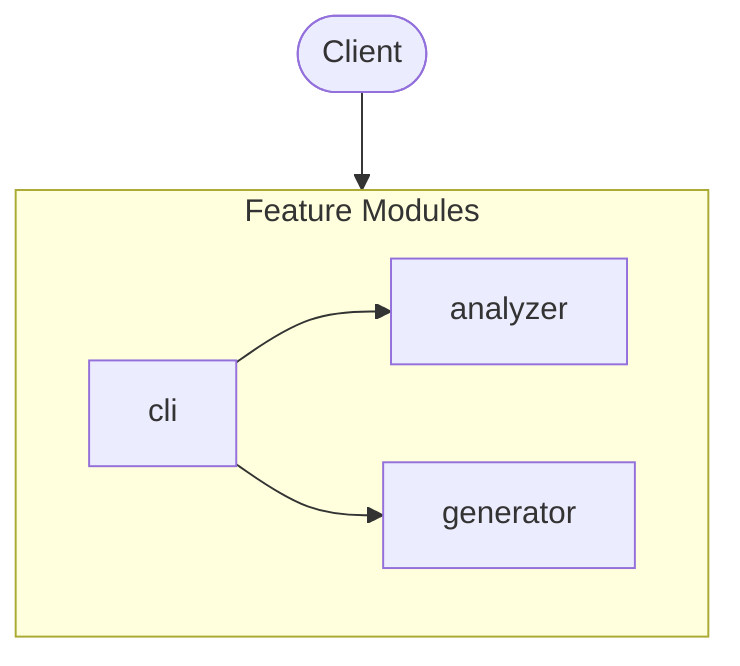

# zinsight

> Instant insight into any codebase. Auto-generate rich architecture docs with Mermaid diagrams, API endpoints, database schemas, external integrations, tech stack detection, and code health analysis. Built for AI-generated codebases.

*Auto-generated by [zinsight](https://github.com/zinboard/zinsight) on 2026-05-24*

## What This App Does

> Instant insight into any codebase. Auto-generate rich architecture docs with Mermaid diagrams, API endpoints, database schemas, external integrations, tech stack detection, and code health analysis. Built for AI-generated codebases.

**Zinsight** is a **command-line tool** built with **Node.js**.

### Core Capabilities

- **Analyzer management**
- **Generator management**
- **Cli management**

In total, the system exposes **4** modules.


## Overview

| **27** files · **10,096** lines of code · **4** modules |
|---|

**Project docs:** [zinsight](README.md) · [Security policy](SECURITY.md) · [Contributing to zinsight](CONTRIBUTING.md) · [Changelog](CHANGELOG.md) · [LICENSE](LICENSE) · [Code of Conduct](CODE_OF_CONDUCT.md)

## At a Glance

A 60-second mental snapshot — what calls in, what we call out, where state lives.


## Where State Lives

Every persistence and caching surface in the system.

- **File system** — Local file system writes detected — server is not fully stateless.
  - Sample files: `src/cli/index.ts`

## Lifecycle

Things that happen when the app boots, when requests arrive, and when external systems trigger us.

**Scheduled jobs**

- Scheduled background job (trigger: `Periodic interval`) — `src/analyzer/index.ts`

**In-process events**

- In-process event publication / subscription (trigger: `Domain event`) — `src/analyzer/orientation.ts`

## What This Repo Isn't

Stops you looking for things that don't exist here.

- **No frontend in this repo** — _No .tsx/.jsx files and no client/frontend/web/ui folder._
- **No background job queue** — _No bull/bullmq/kafkajs/amqplib/SQS client imports detected._
- **No file uploads** — _No multer/busboy/formidable/FileInterceptor usage detected._
- **No payment processing** — _No payment-provider SDK or service detected._

## Table of Contents

- [What This App Does](#what-this-app-does)
- [Overview](#overview)
- [At a Glance](#at-a-glance)
- [Where State Lives](#where-state-lives)
- [Lifecycle](#lifecycle)
- [What This Repo Isn't](#what-this-repo-isnt)
- [Tech Stack](#tech-stack)
- [Architecture](#architecture)
- [Modules](#modules)
- [Getting Started](#getting-started)
- [Testing](#testing)
- [Hotspots](#hotspots)
- [Contributing](#contributing)
- [New Developer Guide](#new-developer-guide)

## Tech Stack

| Category | Technologies |
|----------|-------------|
| **Runtime** | Node.js |
| **Languages** | TypeScript |
| **Testing** | Jest |
| **Build & Dev Tools** | TypeScript |

## Architecture



## Modules

| Module | Purpose | Files | Lines |
|--------|---------|-------|-------|
| **analyzer** | Code analysis pipeline. | 22 | 6,202 |
| **generator** | Output generation (rendering, templating). | 2 | 3,406 |
| **cli** | Command-line interface entry points. | 1 | 90 |

## Getting Started

### Prerequisites

- **Node.js** (check `.nvmrc` or `engines` in package.json for version)
- **npm** as package manager

### Installation

```bash
# Clone the repository
git clone <repository-url>
cd <project-directory>

# Install dependencies
npm install
```

### Running Locally

```bash
# Start development server with hot reload
npm run dev

# Start production server
npm start

# Build for production
npm run build

# Run linter
npm run lint

```

## Testing

**Framework:** Jest

```bash
# Run tests
npm test
```

## Contributing

> Thanks for opening this file — the project is open to outside contributors and

See [`CONTRIBUTING.md`](CONTRIBUTING.md) for full guidelines.

**Topics covered:**

- Quick start
- What kind of contributions help
- How a good PR looks
- Reporting bugs
- Reporting security issues
- License

**Quick workflow:**

1. Create a feature branch from `main`
2. Run `npm run lint` before committing
3. Run `npm test` to ensure tests pass
4. Run `npm run build` to verify the build succeeds
5. Open a pull request with a clear description

## Hotspots

Files most-changed in the last 180 days. Hotspots = where bugs live and where docs matter most.

| Rank | File | Changes | Authors | Last touched |
|------|------|---------|---------|--------------|
| 1 | `src/analyzer/deployment.ts` | 2 | 1 | 2026-05-14 |
| 2 | `src/analyzer/docs.ts` | 2 | 1 | 2026-05-14 |
| 3 | `src/analyzer/file-discovery.ts` | 2 | 1 | 2026-05-14 |
| 4 | `src/analyzer/swagger.ts` | 2 | 1 | 2026-05-14 |
| 5 | `src/analyzer/complexity.ts` | 1 | 1 | 2026-05-14 |
| 6 | `src/analyzer/contracts.ts` | 1 | 1 | 2026-05-14 |
| 7 | `src/analyzer/database.ts` | 1 | 1 | 2026-05-14 |
| 8 | `src/analyzer/dependency-graph.ts` | 1 | 1 | 2026-05-14 |
| 9 | `src/analyzer/entry-points.ts` | 1 | 1 | 2026-05-14 |
| 10 | `src/analyzer/external-services.ts` | 1 | 1 | 2026-05-14 |
| 11 | `src/analyzer/frontend.ts` | 1 | 1 | 2026-05-14 |
| 12 | `src/analyzer/git-heatmap.ts` | 1 | 1 | 2026-05-14 |
| 13 | `src/analyzer/glossary.ts` | 1 | 1 | 2026-05-14 |
| 14 | `src/analyzer/happy-path.ts` | 1 | 1 | 2026-05-14 |
| 15 | `src/analyzer/import-resolver.ts` | 1 | 1 | 2026-05-14 |
| _… 12 more files with changes_ | | | | |

## New Developer Guide

> Everything you need to get oriented in this codebase as a new team member.

### Project Structure

```
src/
├── analyzer/               # Business logic / services (22 files, 6,202 loc)
├── generator/              # Generator module (2 files, 3,406 loc)
└── cli/                    # Cli module (1 files, 90 loc)
```

### Key Files

| # | File | Category | Lines | Why read this |
|---|------|----------|-------|---------------|
| 1 | `src/types.ts` | Type Definitions | 382 | Shared type contracts imported by 21 files — defines: ProjectKind, Language, ProjectInfo, CapabilitySet (+37 more) |
| 2 | `src/generator/markdown.ts` | Business Logic | 3404 | Core module imported by 1 file — exports: generateMarkdown. |
| 3 | `src/analyzer/index.ts` | Business Logic | 748 | Core module imported by 2 files — exports: analyze. |
| 4 | `src/analyzer/external-services.ts` | Business Logic | 319 | Implements analyzer business logic (319 lines) — consumed by 1 files, exports: detectExternalServices |

### Patterns

- **Barrel Exports** — 4 index files re-export module contents. Import from the directory (e.g., `from './feature'`) rather than individual files.

### Common Tasks

| If you want to... | Start here | Pattern to follow |
|-------------------|-----------|-------------------|
| Understand the startup flow | `src/index.ts` | Follow imports from main → app module → feature modules |

---

*Generated by [zinsight](https://github.com/zinboard/zinsight)*
