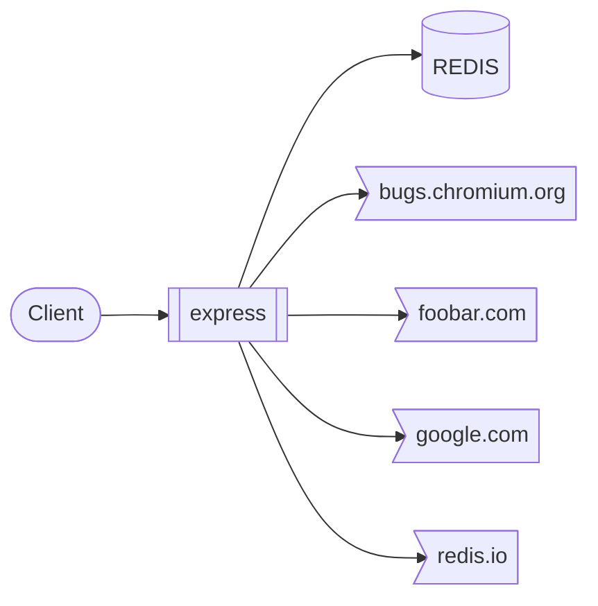
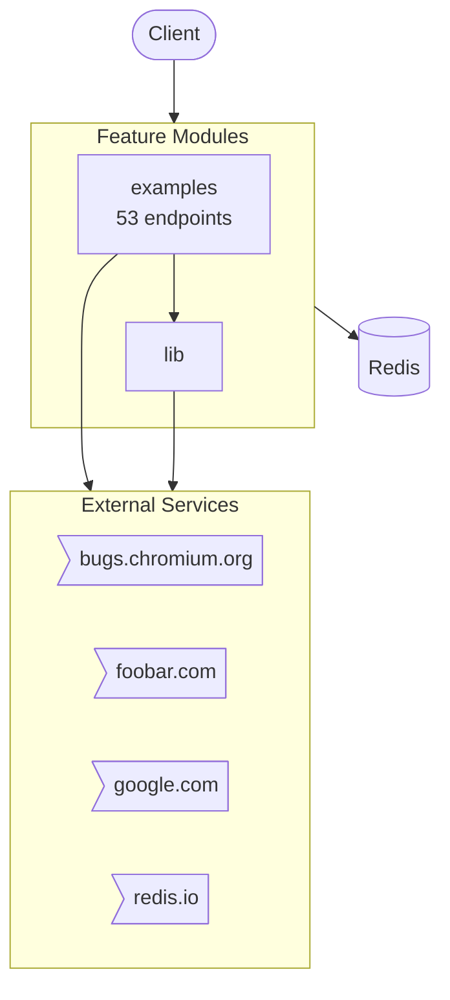
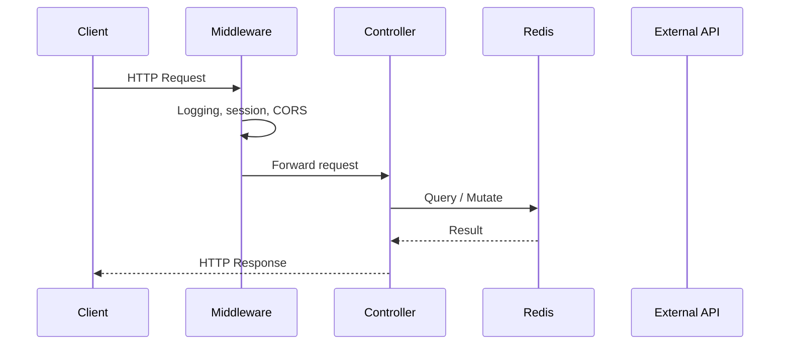
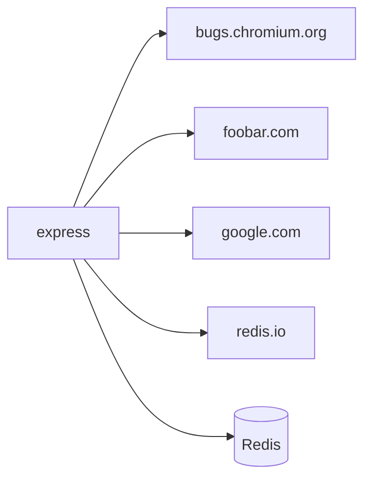

# express

> Fast, unopinionated, minimalist web framework

*Auto-generated by [zinsight](https://github.com/zinboard/zinsight) on YYYY-MM-DD*

## What This App Does

> Fast, unopinionated, minimalist web framework

**Express** is a **command-line tool** built with **Node.js**.

The codebase follows a **controller-service** architecture — each feature is a self-contained module with clear separation between HTTP handling (controllers), business logic (services), and data access (schemas).

### Core Capabilities

- **Admin panel**
- **Member/user management**
- **Blog/content management**
- **Search functionality**

In total, the system exposes **210** API endpoints, **4** modules.

**Connects to:** **Redis** for data storage · **Google** APIs

## Overview

| **141** files · **21,487** lines of code · **4** modules · **210** API endpoints · **0** data models · Redis |
|---|

**Project docs:** [Table of contents](README.md) · [Unreleased Changes](HISTORY.md) · [LICENSE](LICENSE)

## At a Glance

A 60-second mental snapshot — what calls in, what we call out, where state lives.



## Core Concepts

Domain vocabulary used throughout the codebase. Read this first if names look unfamiliar.

| Term | Kind | What it means | Defined in |
|------|------|---------------|------------|
| ***path** | `route` | HTTP resource at `/*path` (1 endpoint). Sample: `/*path`. | `test/app.router.js` |
| ***splat** | `route` | HTTP resource at `/*splat` (2 endpoints). Sample: `/*splat`. | `test/app.all.js` |
| **403** | `route` | HTTP resource at `/403` (1 endpoint). Sample: `/403`. | `examples/error-pages/index.js` |
| **404** | `route` | HTTP resource at `/404` (1 endpoint). Sample: `/404`. | `examples/error-pages/index.js` |
| **500** | `route` | HTTP resource at `/500` (1 endpoint). Sample: `/500`. | `examples/error-pages/index.js` |
| **Account** | `route` | HTTP resource at `/account` (1 endpoint). Sample: `/account/edit`. | `test/app.router.js` |
| **Admin** | `route` | HTTP resource at `/admin` (3 endpoints). Sample: `/admin`. | `test/app.js` |
| **Api** | `route` | HTTP resource at `/api` (7 endpoints). Sample: `/api`. | `examples/web-service/index.js` |
| **Bar** | `route` | HTTP resource at `/bar` (6 endpoints). Sample: `/bar`. | `test/Router.js` |
| **Blog** | `route` | HTTP resource at `/blog` (9 endpoints). Sample: `/blog`. | `test/Router.js` |
| **Client.js** | `route` | HTTP resource at `/client.js` (1 endpoint). Sample: `/client.js`. | `examples/search/index.js` |
| **Fail** | `route` | HTTP resource at `/fail` (1 endpoint). Sample: `/fail`. | `examples/markdown/index.js` |
| **Files** | `route` | HTTP resource at `/files` (1 endpoint). Sample: `/files/*file`. | `examples/downloads/index.js` |
| **Foo** | `route` | HTTP resource at `/foo` (37 endpoints). Sample: `/foo`. | `test/Router.js` |
| **Forget** | `route` | HTTP resource at `/forget` (1 endpoint). Sample: `/forget`. | `examples/cookies/index.js` |
| **Forum** | `route` | HTTP resource at `/forum` (1 endpoint). Sample: `/forum`. | `test/app.use.js` |
| **Login** | `route` | HTTP resource at `/login` (2 endpoints). Sample: `/login`. | `examples/auth/index.js` |
| **Logout** | `route` | HTTP resource at `/logout` (1 endpoint). Sample: `/logout`. | `examples/auth/index.js` |
| **Middleware** | `route` | HTTP resource at `/middleware` (1 endpoint). Sample: `/middleware`. | `examples/view-locals/index.js` |
| **Middleware-locals** | `route` | HTTP resource at `/middleware-locals` (1 endpoint). Sample: `/middleware-locals`. | `examples/view-locals/index.js` |
| **Next** | `route` | HTTP resource at `/next` (1 endpoint). Sample: `/next`. | `examples/error/index.js` |
| **Other** | `route` | HTTP resource at `/other` (1 endpoint). Sample: `/other`. | `test/app.options.js` |
| **Post** | `route` | HTTP resource at `/post` (3 endpoints). Sample: `/post/:article`. | `test/app.use.js` |
| **Posts** | `route` | HTTP resource at `/posts` (1 endpoint). Sample: `/posts`. | `examples/route-separation/index.js` |
| **Proxy** | `route` | HTTP resource at `/proxy` (2 endpoints). Sample: `/proxy`. | `test/Router.js` |
| _… 9 more_ | | | |

## Walking Through One Request

The most-trafficked path is **`GET /:action`**. Picked from the app.router.js (67 endpoints in that file) — typical read-by-id path through the system.

Trace this once and you understand the whole request lifecycle.

1. **Client sends GET /:action**
2. **Middleware runs: index.js, middleware.basic.js**
   Session/CORS/logging applied to every request before guards.
3. **Controller `anonymous()` is invoked** — `test/app.router.js`
   Defined in test/app.router.js.
4. **Service `anonymous()` runs business logic** — `test/app.router.js`
   Controller delegates to the matching service; data validation and authorization checks live here.
5. **Response returned to client (JSON)**
   NestJS / Express serializes the service return value.

## Where State Lives

Every persistence and caching surface in the system.

- **Persistent (database)** — REDIS — 0 models, 4 distinct operations.
  - Sample files: `examples/online/index.js`, `examples/params/index.js`, `examples/resource/index.js`, `examples/route-middleware/index.js`, `examples/route-separation/index.js`
- **Redis** — Redis — likely caching or session/queue store.
  - Sample files: `examples/online/index.js`, `examples/search/index.js`
- **Cookies / sessions** — HTTP cookies / sessions (request-scoped, set on responses).
  - Sample files: `examples/auth/index.js`, `examples/cookies/index.js`, `examples/mvc/index.js`, `examples/route-separation/index.js`, `examples/session/index.js`
- **Environment variables** — 2 environment variables drive runtime behaviour.

## External Contracts

Every connection to a system outside this repo — what we send, what we receive, how we authenticate.

| Service | Direction | We call | They call us | Auth |
|---------|-----------|---------|--------------|------|
| **bugs.chromium.org** | outbound | `HTTPS · bugs.chromium.org` | — | API key |
| **foobar.com** | outbound | `HTTPS · foobar.com` | — | Unknown |
| **google.com** | outbound | `HTTPS · google.com` | — | Unknown |
| **redis.io** | outbound | `HTTPS · redis.io` | — | Unknown |

## Lifecycle

Things that happen when the app boots, when requests arrive, and when external systems trigger us.

**Per request**

- Per-request lifecycle: middleware → guards → controller → service → response (trigger: `Each HTTP request`)

**In-process events**

- In-process event publication / subscription (trigger: `Domain event`) — `lib/express.js`

## How to Get Productive

Pick a goal — read the listed files in order — be productive in minutes, not days.

### Understand the request lifecycle (15 min)

1. `index.js` — Where the app boots and registers everything.
2. `examples/route-middleware/index.js` — Wraps every request — sets req.auth or session.

## Where to Look

Common questions answered up front. If you want to change something, this tells you which files to open.

| If you want to change... | Look in |
|--------------------------|---------|
| **Authentication / Login** — _Identity, sessions, login flows._ | `examples/auth/index.js`, `examples/session/index.js`, `examples/session/redis.js`, `test/acceptance/auth.js` |
| **Configuration / Environment** — _Where env vars are read and the server bootstraps._ | `examples/cookies/index.js`, `examples/error-pages/index.js`, `examples/route-map/index.js`, `lib/application.js`, `test/app.js` |
| **Caching** — _In-memory, Redis, or other caches._ | `examples/session/redis.js` |
| **Logging** — _Structured logs and log destinations._ | `examples/auth/index.js`, `examples/content-negotiation/index.js`, `examples/cookie-sessions/index.js`, `examples/cookies/index.js`, `examples/downloads/index.js` |
| **File uploads** — _How user-uploaded files are handled._ | `test/res.attachment.js` |

## What This Repo Isn't

Stops you looking for things that don't exist here.

- **No frontend in this repo** — _No .tsx/.jsx files and no client/frontend/web/ui folder._
- **No background job queue** — _No bull/kafka/rabbitmq/sqs imports detected._
- **No file uploads** — _No multer/busboy/formidable/FileInterceptor usage detected._
- **No payment processing** — _No payment-provider integration detected._
- **Single-region deployment (no multi-region replication detected)** — _No explicit multi-region configuration found._

## Table of Contents

- [What This App Does](#what-this-app-does)
- [Overview](#overview)
- [At a Glance](#at-a-glance)
- [Core Concepts](#core-concepts)
- [Walking Through One Request](#walking-through-one-request)
- [Where State Lives](#where-state-lives)
- [External Contracts](#external-contracts)
- [Lifecycle](#lifecycle)
- [How to Get Productive](#how-to-get-productive)
- [Where to Look](#where-to-look)
- [What This Repo Isn't](#what-this-repo-isnt)
- [Tech Stack](#tech-stack)
- [Architecture](#architecture)
- [Modules](#modules)
- [API Endpoints](#api-endpoints)
- [Database](#database)
- [External Integrations](#external-integrations)
- [Deployment](#deployment)
- [Environment Variables](#environment-variables)
- [Getting Started](#getting-started)
- [Testing](#testing)
- [Hotspots](#hotspots)
- [New Developer Guide](#new-developer-guide)

## Tech Stack

| Category | Technologies |
|----------|-------------|
| **Runtime** | Node.js |
| **Languages** | JavaScript |
| **Testing** | Mocha, NYC (Coverage), SuperTest |
| **Build & Dev Tools** | ESLint |

## Architecture



### Request Lifecycle



## Modules

| Module | Purpose | Files | Lines |
|--------|---------|-------|-------|
| **examples** | Feature module — 42 files, 18 public exports. (53 endpoints) <br/><sub>📄 [Express examples](examples/README.md) — This page contains list of examples using Express.</sub> | 42 | 2,093 |
| **lib** | Feature module — 7 files, 3 public exports. | 7 | 2,852 |

## API Endpoints — 53 endpoints

### Index.Js — 8 endpoints

`examples/route-separation/index.js`

| Method | Path | Handler | Description |
|--------|------|---------|-------------|
| GET | `/` | `anonymous`| List resource |
| GET | `/posts` | `anonymous`| List posts |
| GET | `/user/:id` | `anonymous`| Get user by ID |
| ALL | `/user/:id{/:op}` | `anonymous`| ALL user |
| GET | `/user/:id/edit` | `anonymous`| Get edit by ID |
| PUT | `/user/:id/edit` | `anonymous`| Replace edit |
| GET | `/user/:id/view` | `anonymous`| Get view by ID |
| GET | `/users` | `anonymous`| List users |

### Index.Js — 5 endpoints

`examples/auth/index.js`

| Method | Path | Handler | Description |
|--------|------|---------|-------------|
| GET | `/` | `anonymous`| List resource |
| GET | `/login` | `anonymous`| List login |
| POST | `/login` | `anonymous`| Create login |
| GET | `/logout` | `anonymous`| List logout |
| GET | `/restricted` | `restrict`| Restrict |

### Index.Js — 4 endpoints

`examples/error-pages/index.js`

| Method | Path | Handler | Description |
|--------|------|---------|-------------|
| GET | `/` | `anonymous`| List resource |
| GET | `/403` | `anonymous`| List 403 |
| GET | `/404` | `anonymous`| List 404 |
| GET | `/500` | `anonymous`| List 500 |

### Index.Js — 4 endpoints

`examples/route-middleware/index.js`

| Method | Path | Handler | Description |
|--------|------|---------|-------------|
| GET | `/` | `anonymous`| List resource |
| DELETE | `/user/:id` | `loadUser`| Load user |
| GET | `/user/:id` | `loadUser`| Load user |
| GET | `/user/:id/edit` | `loadUser`| Load user |

### Index.Js — 3 endpoints

`examples/cookies/index.js`

| Method | Path | Handler | Description |
|--------|------|---------|-------------|
| GET | `/` | `anonymous`| List resource |
| POST | `/` | `anonymous`| Create resource |
| GET | `/forget` | `anonymous`| List forget |

### Index.Js — 3 endpoints

`examples/params/index.js`

| Method | Path | Handler | Description |
|--------|------|---------|-------------|
| GET | `/` | `anonymous`| List resource |
| GET | `/user/:user` | `anonymous`| Get user by ID |
| GET | `/users/:from-:to` | `anonymous`| Get users by ID |

### Index.Js — 3 endpoints

`examples/view-locals/index.js`

| Method | Path | Handler | Description |
|--------|------|---------|-------------|
| GET | `/` | `anonymous`| List resource |
| GET | `/middleware` | `count`| Get middleware count |
| GET | `/middleware-locals` | `count2`| Count 2 |

### Index.Js — 3 endpoints

`examples/web-service/index.js`

| Method | Path | Handler | Description |
|--------|------|---------|-------------|
| GET | `/api/repos` | `anonymous`| List repos |
| GET | `/api/user/:name/repos` | `anonymous`| Get repos by ID |
| GET | `/api/users` | `anonymous`| List users |

### Index.Js — 2 endpoints

`examples/content-negotiation/index.js`

| Method | Path | Handler | Description |
|--------|------|---------|-------------|
| GET | `/` | `anonymous`| List resource |
| GET | `/users` | `anonymous`| List users |

### Index.Js — 2 endpoints

`examples/downloads/index.js`

| Method | Path | Handler | Description |
|--------|------|---------|-------------|
| GET | `/` | `anonymous`| List resource |
| GET | `/files/*file` | `anonymous`| List *file |

### Index.Js — 2 endpoints

`examples/error/index.js`

| Method | Path | Handler | Description |
|--------|------|---------|-------------|
| GET | `/` | `anonymous`| List resource |
| GET | `/next` | `anonymous`| List next |

### Index.Js — 2 endpoints

`examples/markdown/index.js`

| Method | Path | Handler | Description |
|--------|------|---------|-------------|
| GET | `/` | `anonymous`| List resource |
| GET | `/fail` | `anonymous`| List fail |

### Index.Js — 2 endpoints

`examples/view-constructor/index.js`

| Method | Path | Handler | Description |
|--------|------|---------|-------------|
| GET | `/` | `anonymous`| List resource |
| GET | `/Readme.md` | `anonymous`| List readme.md |

### Index.Js — 2 endpoints

`examples/search/index.js`

| Method | Path | Handler | Description |
|--------|------|---------|-------------|
| GET | `/client.js` | `anonymous`| List client.js |
| GET | `/search/{:query}` | `anonymous`| Get search by ID |

### Index.Js — 1 endpoint

`examples/cookie-sessions/index.js`

| Method | Path | Handler | Description |
|--------|------|---------|-------------|
| GET | `/` | `anonymous`| List resource |

### Index.Js — 1 endpoint

`examples/ejs/index.js`

| Method | Path | Handler | Description |
|--------|------|---------|-------------|
| GET | `/` | `anonymous`| List resource |

### Index.Js — 1 endpoint

`examples/hello-world/index.js`

| Method | Path | Handler | Description |
|--------|------|---------|-------------|
| GET | `/` | `anonymous`| List resource |

### Index.Js — 1 endpoint

`examples/multi-router/index.js`

| Method | Path | Handler | Description |
|--------|------|---------|-------------|
| GET | `/` | `anonymous`| List resource |

### Index.Js — 1 endpoint

`examples/online/index.js`

| Method | Path | Handler | Description |
|--------|------|---------|-------------|
| GET | `/` | `anonymous`| List resource |

### Index.Js — 1 endpoint

`examples/resource/index.js`

| Method | Path | Handler | Description |
|--------|------|---------|-------------|
| GET | `/` | `anonymous`| List resource |

### Index.Js — 1 endpoint

`examples/session/index.js`

| Method | Path | Handler | Description |
|--------|------|---------|-------------|
| GET | `/` | `anonymous`| List resource |

### Redis.Js — 1 endpoint

`examples/session/redis.js`

| Method | Path | Handler | Description |
|--------|------|---------|-------------|
| GET | `/` | `anonymous`| List resource |

<details>
<summary>Middleware (75)</summary>

- `/` → `middleware` (`test/Router.js`)
- `/` → `anonymous` (`test/Router.js`)
- `/` → `anonymous` (`test/Router.js`)
- `/` → `anonymous` (`test/Router.js`)
- `/` → `anonymous` (`test/Router.js`)
- `/` → `middleware` (`test/app.use.js`)
- `/` → `anonymous` (`test/app.use.js`)
- `/` → `anonymous` (`test/app.use.js`)
- `/` → `anonymous` (`test/app.use.js`)
- `/` → `anonymous` (`test/app.use.js`)
- `/` → `anonymous` (`test/req.baseUrl.js`)
- `/:a` → `sub` (`test/req.baseUrl.js`)
- `/:a` → `sub1` (`test/req.baseUrl.js`)
- `/:a` → `sub1` (`test/req.baseUrl.js`)
- `/:b` → `sub2` (`test/req.baseUrl.js`)
- `/:c` → `sub3` (`test/req.baseUrl.js`)
- `/:c` → `sub3` (`test/req.baseUrl.js`)
- `/:foo` → `another` (`test/Router.js`)
- `/:user` → `anonymous` (`test/Router.js`)
- `/:user/bob/` → `sub` (`test/Router.js`)
- `/admin` → `blogAdmin` (`test/app.js`)
- `/admin` → `admin` (`test/app.js`)
- `/admin` → `blogAdmin` (`test/app.js`)
- `/api` → `anonymous` (`examples/web-service/index.js`)
- `/api/v1` → `anonymous` (`examples/multi-router/index.js`)
- `/api/v2` → `anonymous` (`examples/multi-router/index.js`)
- `/bar` → `sub2` (`test/req.baseUrl.js`)
- `/bar` → `anonymous` (`test/req.baseUrl.js`)
- `/blog` → `anonymous` (`test/Router.js`)
- `/blog` → `anonymous` (`test/Router.js`)
- `/blog` → `anonymous` (`test/Router.js`)
- `/blog` → `anonymous` (`test/Router.js`)
- `/blog` → `blog` (`test/app.js`)
- `/blog` → `blog` (`test/app.js`)
- `/blog` → `blog` (`test/app.js`)
- `/blog` → `blog` (`test/app.use.js`)
- `/blog` → `blog` (`test/app.use.js`)
- `/foo` → `another` (`test/Router.js`)
- `/foo` → `anonymous` (`test/app.use.js`)
- `/foo` → `fn1` (`test/app.use.js`)
- `/foo` → `anonymous` (`test/app.use.js`)
- `/foo` → `anonymous` (`test/app.use.js`)
- `/foo` → `anonymous` (`test/app.use.js`)
- `/foo` → `anonymous` (`test/app.use.js`)
- `/foo/` → `anonymous` (`test/app.use.js`)
- `/foo/:id/bar` → `anonymous` (`test/Router.js`)
- `/foo/:ms/` → `anonymous` (`test/Router.js`)
- `/foo/:ms/` → `sub` (`test/Router.js`)
- `/foo/:user/` → `anonymous` (`test/Router.js`)
- `/foo/:user/` → `sub` (`test/Router.js`)
- `/foo/:user/` → `anonymous` (`test/Router.js`)
- `/forum` → `forum` (`test/app.use.js`)
- `/post/:article` → `blog` (`test/app.use.js`)
- `/post/:article` → `fn1` (`test/app.use.js`)
- `/proxy` → `anonymous` (`test/Router.js`)
- `/proxy` → `anonymous` (`test/Router.js`)
- `/static` → `anonymous` (`examples/static-files/index.js`)
- `/static` → `anonymous` (`test/express.static.js`)
- `/static` → `anonymous` (`test/express.static.js`)
- `/sub` → `app2` (`test/app.request.js`)
- `/sub` → `app2` (`test/app.request.js`)
- `/sub` → `app2` (`test/app.request.js`)
- `/sub` → `app2` (`test/app.response.js`)
- `/sub` → `app2` (`test/app.response.js`)
- `/sub` → `app2` (`test/app.response.js`)
- `/todo.txt` → `anonymous` (`test/express.static.js`)
- `/user` → `anonymous` (`test/app.router.js`)
- `/user` → `anonymous` (`test/app.router.js`)
- `/user/` → `anonymous` (`test/app.router.js`)
- `/user/` → `anonymous` (`test/app.router.js`)
- `/user/` → `anonymous` (`test/app.router.js`)
- `/user/:thing` → `router` (`test/app.router.js`)
- `/user/:user` → `router` (`test/app.router.js`)
- `/user/:user` → `router` (`test/app.router.js`)
- `/users` → `anonymous` (`test/express.static.js`)

</details>

## Database

| **Redis** — 0 models |
|---|

### Running Database Locally

Start a local Redis instance:

```bash
docker run -d --name redis -p 6379:6379 redis:latest
```

**Operations used:** `del`, `get`, `keys`, `set`

## External Integrations



| Service | Type | Methods | Files |
|---------|------|---------|-------|
| **bugs.chromium.org** | api | — | 1 file(s) |
| **foobar.com** | api | — | 1 file(s) |
| **google.com** | api | — | 2 file(s) |
| **redis.io** | api | — | 3 file(s) |

## Deployment

### CI/CD Pipelines

**GitHub Actions** — `.github/workflows/scorecard.yml`

- **Triggers:** branch_protection_rule, schedule, push
- **Jobs:** analysis

**GitHub Actions** — `.github/workflows/legacy.yml`

- **Triggers:** push, pull_request, workflow_dispatch
- **Jobs:** test, coverage

**GitHub Actions** — `.github/workflows/codeql.yml`

- **Triggers:** push, pull_request, schedule, workflow_dispatch
- **Jobs:** analyze

**GitHub Actions** — `.github/workflows/ci.yml`

- **Triggers:** push, pull_request, workflow_dispatch
- **Jobs:** lint, test, coverage

## Environment Variables

### Required vs Optional

**1 required** (no fallback) · **1 optional** (default present in code).

| Required Variable | Risk if missing |
|-------------------|-----------------|
| `NO_DEPRECATION` | Unknown — depends on what this variable controls. |

| Optional Variable | Default | Risk if missing |
|-------------------|---------|-----------------|
| `NODE_ENV` | `development` | Unknown — depends on what this variable controls. |

**Environment**

| Variable | Used in |
|----------|---------|
| `NODE_ENV` | `examples/cookies/index.js`, `examples/error-pages/index.js`, `examples/route-map/index.js`, `lib/application.js`, `test/app.js`, `test/support/env.js` |

**Application**

| Variable | Used in |
|----------|---------|
| `NO_DEPRECATION` | `test/support/env.js` |

## Getting Started

### Prerequisites

- **Node.js** (check `.nvmrc` or `engines` in package.json for version)
- **npm** as package manager

### Installation

```bash
# Clone the repository
git clone <repository-url>
cd <project-directory>

# Install dependencies
npm install

# Set up environment variables
cp .env.example .env  # then fill in your values
```

### Running Locally

```bash
# Run linter
npm run lint

```

## Testing

**Framework:** Mocha, NYC (Coverage), SuperTest

```bash
# Run tests
npm test
```

## Usage Examples

> Example API calls for key endpoints. Replace `localhost:3000` with your actual host.

```bash
# anonymous
curl -X GET http://localhost:3000/

# anonymous
curl -X GET http://localhost:3000/api/user/{name}/repos

# anonymous
curl -X GET http://localhost:3000/403

# anonymous
curl -X POST http://localhost:3000/ \
  -H "Content-Type: application/json" \
  -d '{ }'

# anonymous
curl -X PUT http://localhost:3000/user/{id}/edit \
  -H "Content-Type: application/json" \
  -d '{ }'

# loadUser
curl -X DELETE http://localhost:3000/user/{id}
```

## Hotspots

Files most-changed in the last 180 days. Hotspots = where bugs live and where docs matter most.

| Rank | File | Changes | Authors | Last touched |
|------|------|---------|---------|--------------|
| 1 | `examples/auth/index.js` | 1 | 1 | 2026-04-23 |
| 2 | `examples/content-negotiation/db.js` | 1 | 1 | 2026-04-23 |
| 3 | `examples/content-negotiation/index.js` | 1 | 1 | 2026-04-23 |
| 4 | `examples/content-negotiation/users.js` | 1 | 1 | 2026-04-23 |
| 5 | `examples/cookie-sessions/index.js` | 1 | 1 | 2026-04-23 |
| 6 | `examples/cookies/index.js` | 1 | 1 | 2026-04-23 |
| 7 | `examples/downloads/index.js` | 1 | 1 | 2026-04-23 |
| 8 | `examples/ejs/index.js` | 1 | 1 | 2026-04-23 |
| 9 | `examples/error-pages/index.js` | 1 | 1 | 2026-04-23 |
| 10 | `examples/error/index.js` | 1 | 1 | 2026-04-23 |
| 11 | `examples/hello-world/index.js` | 1 | 1 | 2026-04-23 |
| 12 | `examples/markdown/index.js` | 1 | 1 | 2026-04-23 |
| 13 | `examples/multi-router/controllers/api_v1.js` | 1 | 1 | 2026-04-23 |
| 14 | `examples/multi-router/controllers/api_v2.js` | 1 | 1 | 2026-04-23 |
| 15 | `examples/multi-router/index.js` | 1 | 1 | 2026-04-23 |
| _… 126 more files with changes_ | | | | |

## New Developer Guide

> Everything you need to get oriented in this codebase as a new team member.

### Project Structure

```
└── examples/               # Feature module (API + business logic) (42 files, 2,093 loc)
```

### Key Files

| # | File | Category | Lines | Why read this |
|---|------|----------|-------|---------------|
| 1 | `index.js` | Entry Point | 12 | Application bootstrap — initializes 1 dependencies, sets up middleware, and starts the server. Start here to understand how the app is wired together |
| 2 | `test/config.js` | Configuration | 208 | Configuration for test — defines environment-specific settings and constants |
| 3 | `examples/auth/index.js` | Security | 135 | Core auth module referenced by 1 files — handles authentication flow, token validation, and session management. |
| 4 | `test/acceptance/auth.js` | Security | 118 | Core auth module referenced by 0 files — handles authentication flow, token validation, and session management. |
| 5 | `test/acceptance/web-service.js` | Business Logic | 106 | Implements acceptance business logic (106 lines) — powers 228 API endpoints |
| 6 | `examples/web-service/index.js` | Business Logic | 118 | Implements web service business logic (118 lines) — consumed by 1 files, powers 57 API endpoints |
| 7 | `examples/multi-router/controllers/api_v1.js` | API Surface | 16 | HTTP controller for controllers — handles incoming requests and delegates to services |
| 8 | `examples/multi-router/controllers/api_v2.js` | API Surface | 16 | HTTP controller for controllers — handles incoming requests and delegates to services |
| 9 | `examples/mvc/controllers/pet/index.js` | API Surface | 32 | HTTP controller for pet — handles incoming requests and delegates to services |
| 10 | `test/support/utils.js` | Shared Utility | 87 | Shared helpers used by 9 files across the codebase — contains reusable patterns you'll encounter throughout the code |
| 11 | `lib/utils.js` | Shared Utility | 272 | Shared helpers used by 7 files across the codebase — contains reusable patterns you'll encounter throughout the code |

### Patterns

- **Middleware Pipeline** — Requests pass through middleware before reaching handlers. Common uses: logging, auth session, request enrichment.
- **Barrel Exports** — 30 index files re-export module contents. Import from the directory (e.g., `from './feature'`) rather than individual files.

### Common Tasks

| If you want to... | Start here | Pattern to follow |
|-------------------|-----------|-------------------|
| Add a new API endpoint | `test/res.jsonp.js` | Copy an existing controller+service pair and register the module |
| Add an environment variable | `test/config.js` | Add to `.env`, reference via `process.env.VAR_NAME` or config service |
| Understand the startup flow | `index.js` | Follow imports from main → app module → feature modules |
| Debug a failing request | Check controller → service → database query in that order | Most bugs are in the service layer |

---

*Generated by [zinsight](https://github.com/zinboard/zinsight)*
