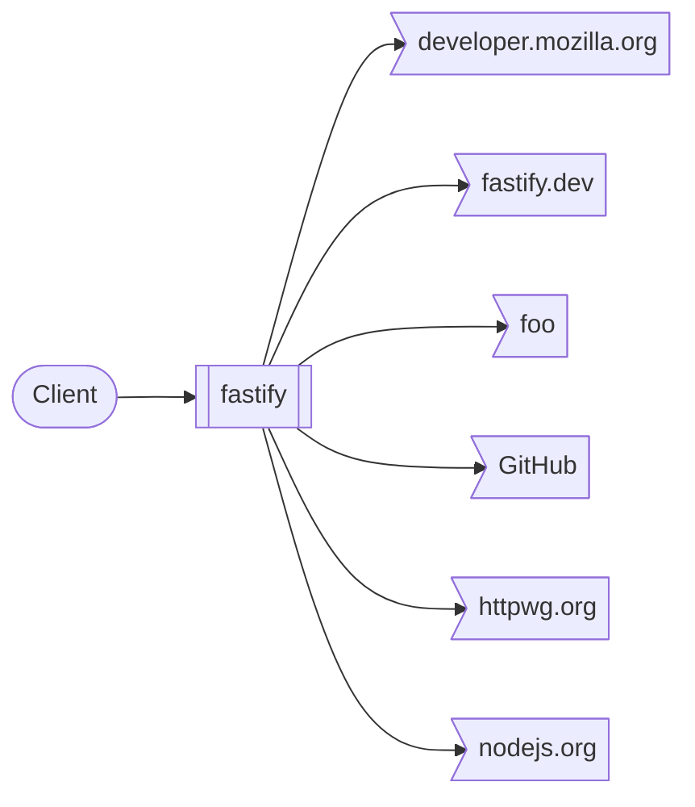
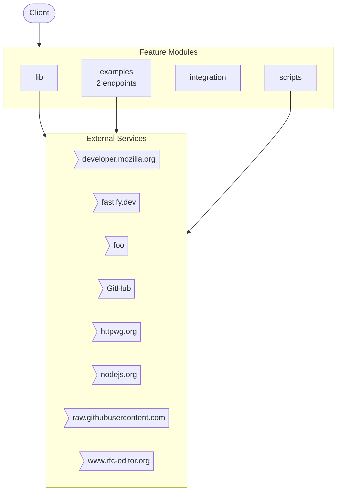
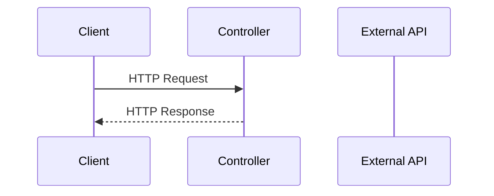
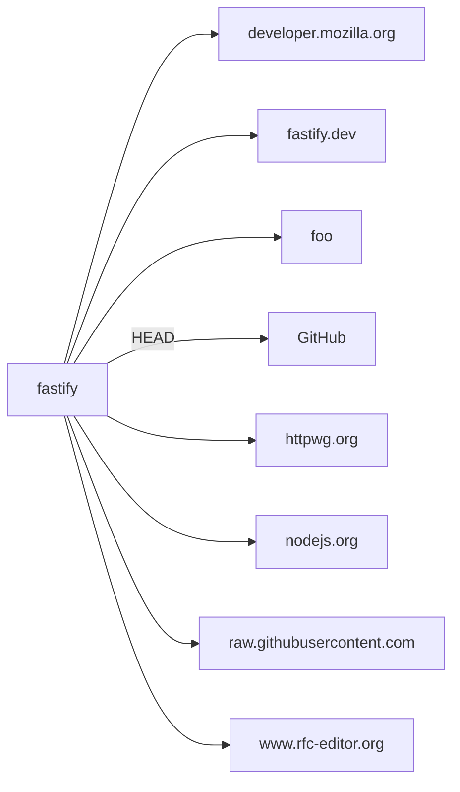

# fastify

> Fast and low overhead web framework, for Node.js

*Auto-generated by [zinsight](https://github.com/zinboard/zinsight) on YYYY-MM-DD*

## What This App Does

> Fast and low overhead web framework, for Node.js

**Fastify** is an **application** built with **Node.js**.

### Core Capabilities

- **Examples management**
- **(Root) management**
- **Integration management**

In total, the system exposes **56** API endpoints, **7** modules.


## Overview

| **88** files · **15,785** lines of code · **7** modules · **56** API endpoints |
|---|

**Project docs:** [Table of Contents](README.md) · [Security Policy](SECURITY.md) · [Fastify is an OPEN Open Source Project](CONTRIBUTING.md) · [LICENSE](LICENSE) · [Code of Conduct](CODE_OF_CONDUCT.md) · [Where To Start](docs/index.md)

## At a Glance

A 60-second mental snapshot — what calls in, what we call out, where state lives.



## Core Concepts

Domain vocabulary used throughout the codebase. Read this first if names look unfamiliar.

| Term | Kind | What it means | Defined in |
|------|------|---------------|------------|
| **Empty-schema** | `route` | HTTP resource at `/empty-schema` (1 endpoint). Sample: `/empty-schema`. | `test/types/schema.test-d.ts` |
| **Full-schema** | `route` | HTTP resource at `/full-schema` (1 endpoint). Sample: `/full-schema`. | `test/types/schema.test-d.ts` |
| **Get** | `route` | HTTP resource at `/get` (2 endpoints). Sample: `/get`. | `test/types/reply.test-d.ts` |
| **Get-generic-array-send** | `route` | HTTP resource at `/get-generic-array-send` (1 endpoint). Sample: `/get-generic-array-send`. | `test/types/reply.test-d.ts` |
| **Get-generic-http-codes-send** | `route` | HTTP resource at `/get-generic-http-codes-send` (1 endpoint). Sample: `/get-generic-http-codes-send`. | `test/types/reply.test-d.ts` |
| **Get-generic-http-codes-send-error-1** | `route` | HTTP resource at `/get-generic-http-codes-send-error-1` (1 endpoint). Sample: `/get-generic-http-codes-send-error-1`. | `test/types/reply.test-d.ts` |
| **Get-generic-http-codes-send-error-2** | `route` | HTTP resource at `/get-generic-http-codes-send-error-2` (1 endpoint). Sample: `/get-generic-http-codes-send-error-2`. | `test/types/reply.test-d.ts` |
| **Get-generic-http-codes-send-error-3** | `route` | HTTP resource at `/get-generic-http-codes-send-error-3` (1 endpoint). Sample: `/get-generic-http-codes-send-error-3`. | `test/types/reply.test-d.ts` |
| **Get-generic-http-codes-send-error-4** | `route` | HTTP resource at `/get-generic-http-codes-send-error-4` (1 endpoint). Sample: `/get-generic-http-codes-send-error-4`. | `test/types/reply.test-d.ts` |
| **Get-generic-http-codes-send-error-5** | `route` | HTTP resource at `/get-generic-http-codes-send-error-5` (1 endpoint). Sample: `/get-generic-http-codes-send-error-5`. | `test/types/reply.test-d.ts` |
| **Get-generic-return** | `route` | HTTP resource at `/get-generic-return` (1 endpoint). Sample: `/get-generic-return`. | `test/types/reply.test-d.ts` |
| **Get-generic-return-error** | `route` | HTTP resource at `/get-generic-return-error` (1 endpoint). Sample: `/get-generic-return-error`. | `test/types/reply.test-d.ts` |
| **Get-generic-send** | `route` | HTTP resource at `/get-generic-send` (1 endpoint). Sample: `/get-generic-send`. | `test/types/reply.test-d.ts` |
| **Get-generic-send-error** | `route` | HTTP resource at `/get-generic-send-error` (1 endpoint). Sample: `/get-generic-send-error`. | `test/types/reply.test-d.ts` |
| **Get-generic-send-missing-payload** | `route` | HTTP resource at `/get-generic-send-missing-payload` (1 endpoint). Sample: `/get-generic-send-missing-payload`. | `test/types/reply.test-d.ts` |
| **Get-generic-union-return** | `route` | HTTP resource at `/get-generic-union-return` (1 endpoint). Sample: `/get-generic-union-return`. | `test/types/reply.test-d.ts` |
| **Get-generic-union-return-error-1** | `route` | HTTP resource at `/get-generic-union-return-error-1` (1 endpoint). Sample: `/get-generic-union-return-error-1`. | `test/types/reply.test-d.ts` |
| **Get-generic-union-return-error-2** | `route` | HTTP resource at `/get-generic-union-return-error-2` (1 endpoint). Sample: `/get-generic-union-return-error-2`. | `test/types/reply.test-d.ts` |
| **Get-generic-union-send** | `route` | HTTP resource at `/get-generic-union-send` (1 endpoint). Sample: `/get-generic-union-send`. | `test/types/reply.test-d.ts` |
| **Get-generic-union-send-error-1** | `route` | HTTP resource at `/get-generic-union-send-error-1` (1 endpoint). Sample: `/get-generic-union-send-error-1`. | `test/types/reply.test-d.ts` |
| **Get-generic-union-send-error-2** | `route` | HTTP resource at `/get-generic-union-send-error-2` (1 endpoint). Sample: `/get-generic-union-send-error-2`. | `test/types/reply.test-d.ts` |
| **Get-http-codes-201-missing-payload** | `route` | HTTP resource at `/get-http-codes-201-missing-payload` (1 endpoint). Sample: `/get-http-codes-201-missing-payload`. | `test/types/reply.test-d.ts` |
| **Get-http-codes-no-content** | `route` | HTTP resource at `/get-http-codes-no-content` (1 endpoint). Sample: `/get-http-codes-no-content`. | `test/types/reply.test-d.ts` |
| **Get-no-type-send-empty** | `route` | HTTP resource at `/get-no-type-send-empty` (1 endpoint). Sample: `/get-no-type-send-empty`. | `test/types/reply.test-d.ts` |
| **Get-undefined-send-empty** | `route` | HTTP resource at `/get-undefined-send-empty` (1 endpoint). Sample: `/get-undefined-send-empty`. | `test/types/reply.test-d.ts` |
| _… 8 more_ | | | |

## Walking Through One Request

The most-trafficked path is **`GET /get`**. Picked from the reply.test-d.ts (25 endpoints in that file) — typical read-by-id path through the system.

Trace this once and you understand the whole request lifecycle.

1. **Client sends GET /get**
2. **Controller `getHandler()` is invoked** — `test/types/reply.test-d.ts`
   Defined in test/types/reply.test-d.ts.
3. **Service `getHandler()` runs business logic** — `test/types/reply.test-d.ts`
   Controller delegates to the matching service; data validation and authorization checks live here.
4. **Response returned to client (JSON)**
   NestJS / Express serializes the service return value.

## Where State Lives

Every persistence and caching surface in the system.

- **Environment variables** — 1 environment variable drive runtime behaviour.
- **File system** — Local file system writes detected — server is not fully stateless.
  - Sample files: `test/logger/logger-test-utils.js`

## External Contracts

Every connection to a system outside this repo — what we send, what we receive, how we authenticate.

| Service | Direction | We call | They call us | Auth |
|---------|-----------|---------|--------------|------|
| **developer.mozilla.org** | outbound | `HTTPS · developer.mozilla.org` | — | Unknown |
| **fastify.dev** | outbound | `HTTPS · fastify.dev` | — | Unknown |
| **foo** | outbound | `HTTPS · foo` | — | Unknown |
| **GitHub** | outbound | `GitHub (HEAD)` | — | Unknown |
| **httpwg.org** | outbound | `httpwg.org` | — | Unknown |
| **nodejs.org** | outbound | `HTTPS · nodejs.org` | — | Unknown |
| **raw.githubusercontent.com** | outbound | `HTTPS · raw.githubusercontent.com` | — | Unknown |
| **www.rfc-editor.org** | outbound | `HTTPS · www.rfc-editor.org` | — | Unknown |

## Lifecycle

Things that happen when the app boots, when requests arrive, and when external systems trigger us.

**Per request**

- Per-request lifecycle: middleware → guards → controller → service → response (trigger: `Each HTTP request`)

## Where to Look

Common questions answered up front. If you want to change something, this tells you which files to open.

| If you want to change... | Look in |
|--------------------------|---------|
| **Configuration / Environment** — _Where env vars are read and the server bootstraps._ | `scripts/validate-ecosystem-links.js` |
| **Caching** — _In-memory, Redis, or other caches._ | `lib/content-type-parser.js`, `lib/content-type.js` |
| **Logging** — _Structured logs and log destinations._ | `lib/logger-factory.js`, `lib/logger-pino.js`, `test/logger/logger-test-utils.js`, `test/types/logger.test-d.ts` |

## What This Repo Isn't

Stops you looking for things that don't exist here.

- **No frontend in this repo** — _No .tsx/.jsx files and no client/frontend/web/ui folder._
- **No background job queue** — _No bull/kafka/rabbitmq/sqs imports detected._
- **No file uploads** — _No multer/busboy/formidable/FileInterceptor usage detected._
- **No payment processing** — _No payment-provider integration detected._
- **Single-region deployment (no multi-region replication detected)** — _No explicit multi-region configuration found._

## Table of Contents

- [What This App Does](#what-this-app-does)
- [Overview](#overview)
- [At a Glance](#at-a-glance)
- [Core Concepts](#core-concepts)
- [Walking Through One Request](#walking-through-one-request)
- [Where State Lives](#where-state-lives)
- [External Contracts](#external-contracts)
- [Lifecycle](#lifecycle)
- [Where to Look](#where-to-look)
- [What This Repo Isn't](#what-this-repo-isnt)
- [Tech Stack](#tech-stack)
- [Architecture](#architecture)
- [Modules](#modules)
- [API Endpoints](#api-endpoints)
- [External Integrations](#external-integrations)
- [Deployment](#deployment)
- [Environment Variables](#environment-variables)
- [Getting Started](#getting-started)
- [Testing](#testing)
- [Hotspots](#hotspots)
- [Contributing](#contributing)
- [New Developer Guide](#new-developer-guide)

## Tech Stack

| Category | Technologies |
|----------|-------------|
| **Runtime** | Node.js |
| **Languages** | TypeScript, JavaScript |
| **HTTP Clients** | Undici |
| **Build & Dev Tools** | ESLint, TypeScript |
| **Other Notable** | Joi, Pino (Logging) |

## Architecture



### Request Lifecycle



## Modules

| Module | Purpose | Files | Lines |
|--------|---------|-------|-------|
| **lib** | Feature module — 31 files, 20 public exports. | 31 | 7,849 |
| **examples** | Feature module — 18 files, 0 public exports. (2 endpoints) | 18 | 752 |
| **integration** | External service clients (OAuth, API calls, webhook handlers). | 1 | 30 |
| **scripts** | Feature module — 1 file, 0 public exports. | 1 | 180 |

## API Endpoints — 2 endpoints

### Simple.Mjs — 1 endpoint

`examples/simple.mjs`

| Method | Path | Handler | Description |
|--------|------|---------|-------------|
| GET | `/` | `schema`| Schema |

### Typescript Server.Ts — 1 endpoint

`examples/typescript-server.ts`

| Method | Path | Handler | Description |
|--------|------|---------|-------------|
| POST | `/ping/:bar` | `opts`| Opts |

## External Integrations



| Service | Type | Methods | Files |
|---------|------|---------|-------|
| **developer.mozilla.org** | api | — | 1 file(s) |
| **fastify.dev** | api | — | 1 file(s) |
| **foo** | api | — | 1 file(s) |
| **GitHub** | api | HEAD | 1 file(s) |
| **httpwg.org** | api | — | 1 file(s) |
| **nodejs.org** | api | — | 2 file(s) |
| **raw.githubusercontent.com** | api | — | 1 file(s) |
| **www.rfc-editor.org** | api | — | 1 file(s) |

## Deployment

### CI/CD Pipelines

**GitHub Actions** — `.github/workflows/website.yml`

- **Triggers:** push, release
- **Jobs:** build

**GitHub Actions** — `.github/workflows/validate-ecosystem-links.yml`

- **Triggers:** schedule, workflow_dispatch
- **Jobs:** validate-links

**GitHub Actions** — `.github/workflows/test-compare.yml`

- **Triggers:** pull_request
- **Jobs:** run

**GitHub Actions** — `.github/workflows/pull-request-title.yml`

- **Triggers:** pull_request
- **Jobs:** pull-request-title-check

**GitHub Actions** — `.github/workflows/package-manager-ci.yml`

- **Triggers:** push
- **Jobs:** pnpm, yarn

**GitHub Actions** — `.github/workflows/missing_types.yml`

- **Triggers:** pull_request
- **Jobs:** create_issue

**GitHub Actions** — `.github/workflows/md-lint.yml`

- **Triggers:** push, pull_request
- **Jobs:** build

**GitHub Actions** — `.github/workflows/lock-threads.yml`

- **Triggers:** schedule, workflow_dispatch
- **Jobs:** lock-threads

**GitHub Actions** — `.github/workflows/lint-ecosystem-order.yml`

- **Triggers:** pull_request
- **Jobs:** build

**GitHub Actions** — `.github/workflows/links-check.yml`

- **Triggers:** pull_request
- **Jobs:** linkChecker

**GitHub Actions** — `.github/workflows/labeler.yml`

- **Jobs:** label

**GitHub Actions** — `.github/workflows/integration.yml`

- **Triggers:** push, pull_request
- **Jobs:** install-production

**GitHub Actions** — `.github/workflows/integration-alternative-runtimes.yml`

- **Triggers:** push, pull_request
- **Jobs:** install-production

**GitHub Actions** — `.github/workflows/coverage-win.yml`

- **Triggers:** workflow_call
- **Jobs:** check-coverage

**GitHub Actions** — `.github/workflows/coverage-nix.yml`

- **Triggers:** workflow_call
- **Jobs:** check-coverage

**GitHub Actions** — `.github/workflows/citgm.yml`

- **Triggers:** pull_request, workflow_dispatch
- **Jobs:** core-plugins, remove-label

**GitHub Actions** — `.github/workflows/citgm-package.yml`

- **Triggers:** workflow_dispatch, workflow_call
- **Jobs:** core-plugins

**GitHub Actions** — `.github/workflows/ci.yml`

- **Triggers:** push, pull_request, workflow_dispatch
- **Jobs:** quality-check, coverage-nix, coverage-win, test-unit, test-unit-custom, test-typescript, test-pino-compat, package, automerge

**GitHub Actions** — `.github/workflows/ci-alternative-runtime.yml`

- **Triggers:** push, pull_request
- **Jobs:** test-unit, test-typescript, package

**GitHub Actions** — `.github/workflows/backport.yml`

- **Triggers:** pull_request_target
- **Jobs:** backport

## Environment Variables

### Required vs Optional

**1 required** (no fallback) · **0 optional** (default present in code).

| Required Variable | Risk if missing |
|-------------------|-----------------|
| `GITHUB_TOKEN` | Integration with this provider unavailable. |

| Variable | Used in |
|----------|---------|
| `GITHUB_TOKEN` | `scripts/validate-ecosystem-links.js` |

## Getting Started

### Prerequisites

- **Node.js** (check `.nvmrc` or `engines` in package.json for version)
- **npm** as package manager

### Installation

```bash
# Clone the repository
git clone <repository-url>
cd <project-directory>

# Install dependencies
npm install

# Set up environment variables
cp .env.example .env  # then fill in your values
```

### Running Locally

```bash
# Run linter
npm run lint

```

## Testing

```bash
# Run tests
npm test

# Run tests in watch mode
npm run test:watch

# Run tests with coverage
npm run coverage
```

## Usage Examples

> Example API calls for key endpoints. Replace `localhost:3000` with your actual host.

```bash
# schema
curl -X GET http://localhost:3000/

# opts
curl -X POST http://localhost:3000/ping/{bar} \
  -H "Content-Type: application/json" \
  -d '{ }'
```

## Contributing

> Individuals making significant and valuable contributions are given

See [`CONTRIBUTING.md`](CONTRIBUTING.md) for full guidelines.

**Topics covered:**

- What?
- I want to be a collaborator!
- Rules
- Fastify previous versions
- Releases
- Plugins
- Changes to this arrangement
- Fastify Organization Structure
- ...and 3 more

**Quick workflow:**

1. Create a feature branch from `main`
2. Run `npm run lint` before committing
3. Run `npm test` to ensure tests pass
4. Open a pull request with a clear description

## Hotspots

Files most-changed in the last 180 days. Hotspots = where bugs live and where docs matter most.

| Rank | File | Changes | Authors | Last touched |
|------|------|---------|---------|--------------|
| 1 | `eslint.config.js` | 1 | 1 | 2026-05-01 |
| 2 | `examples/asyncawait.js` | 1 | 1 | 2026-05-01 |
| 3 | `examples/benchmark/hooks-benchmark-async-await.js` | 1 | 1 | 2026-05-01 |
| 4 | `examples/benchmark/hooks-benchmark.js` | 1 | 1 | 2026-05-01 |
| 5 | `examples/benchmark/parser.js` | 1 | 1 | 2026-05-01 |
| 6 | `examples/benchmark/simple.js` | 1 | 1 | 2026-05-01 |
| 7 | `examples/benchmark/webstream.js` | 1 | 1 | 2026-05-01 |
| 8 | `examples/hooks.js` | 1 | 1 | 2026-05-01 |
| 9 | `examples/http2.js` | 1 | 1 | 2026-05-01 |
| 10 | `examples/https.js` | 1 | 1 | 2026-05-01 |
| 11 | `examples/parser.js` | 1 | 1 | 2026-05-01 |
| 12 | `examples/plugin.js` | 1 | 1 | 2026-05-01 |
| 13 | `examples/route-prefix.js` | 1 | 1 | 2026-05-01 |
| 14 | `examples/shared-schema.js` | 1 | 1 | 2026-05-01 |
| 15 | `examples/simple-stream.js` | 1 | 1 | 2026-05-01 |
| _… 73 more files with changes_ | | | | |

## New Developer Guide

> Everything you need to get oriented in this codebase as a new team member.

### Project Structure

```
├── lib/                    # API controllers (31 files, 7,849 loc)
├── examples/               # Data models (18 files, 752 loc)
├── scripts/                # Scripts module (1 files, 180 loc)
├── test/
│   └── bundler/            # Application source root (4 files, 50 loc)
└── integration/            # Integration module (1 files, 30 loc)
```

### Key Files

| # | File | Category | Lines | Why read this |
|---|------|----------|-------|---------------|
| 1 | `fastify.js` | Entry Point | 985 | Application bootstrap — initializes 20 dependencies, sets up middleware, and starts the server. Start here to understand how the app is wired together |
| 2 | `lib/config-validator.js` | Configuration | 1267 | Configuration for config validator — defines environment-specific settings and constants |
| 3 | `lib/initial-config-validation.js` | Configuration | 38 | Configuration for initial config validation — defines environment-specific settings and constants |
| 4 | `eslint.config.js` | Configuration | 36 | Configuration for eslint.config — defines environment-specific settings and constants |
| 5 | `lib/schemas.js` | Data Model | 215 | Core data structure — shapes the schemas data layer, referenced by 4 files across the codebase |
| 6 | `lib/schema-controller.js` | Data Model | 165 | Core data structure — shapes the schema controller data layer, referenced by 2 files across the codebase |
| 7 | `examples/shared-schema.js` | Data Model | 39 | Core data structure — shapes the examples data layer, referenced by 0 files across the codebase |

### Common Tasks

| If you want to... | Start here | Pattern to follow |
|-------------------|-----------|-------------------|
| Add a new API endpoint | `test/types/hooks.test-d.ts` | Copy an existing controller+service pair and register the module |
| Add an environment variable | `eslint.config.js` | Add to `.env`, reference via `process.env.VAR_NAME` or config service |
| Understand the startup flow | `fastify.js` | Follow imports from main → app module → feature modules |
| Debug a failing request | Check controller → service → database query in that order | Most bugs are in the service layer |

---

*Generated by [zinsight](https://github.com/zinboard/zinsight)*
