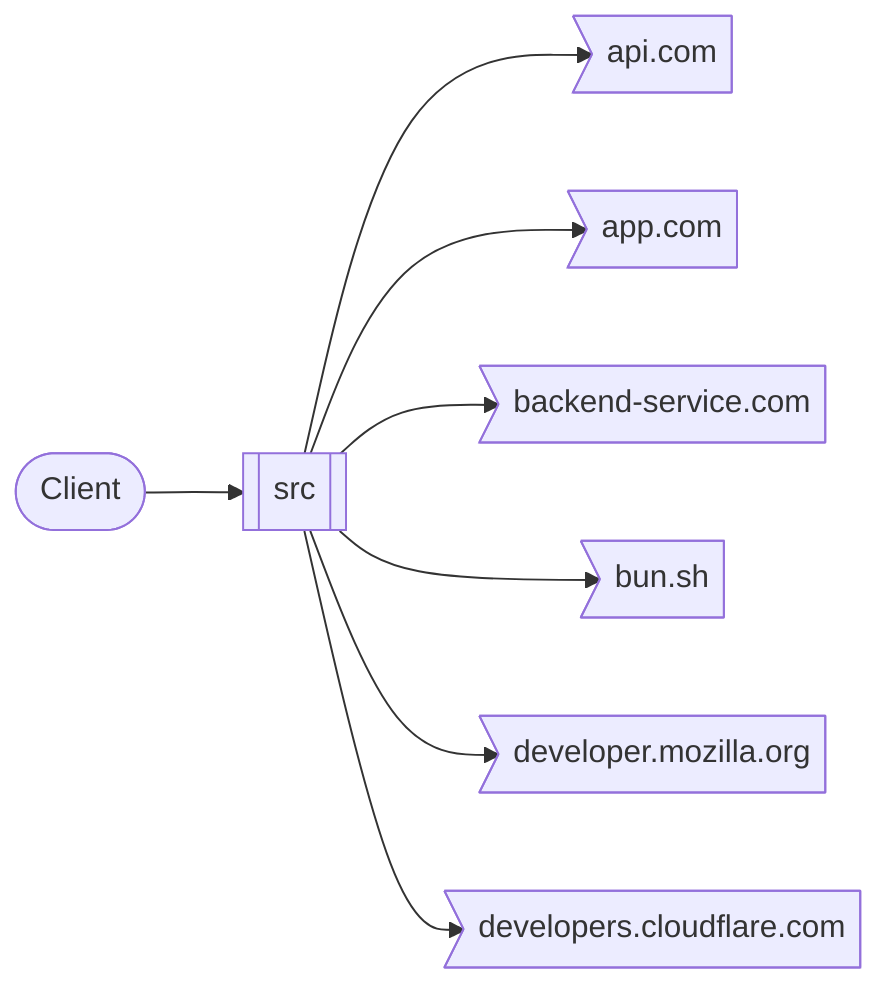
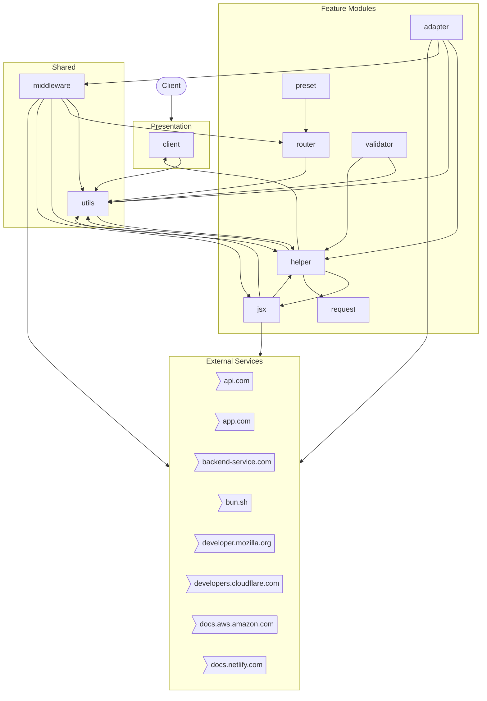
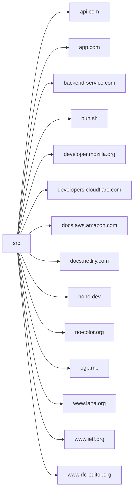

# src

*Auto-generated by [zinsight](https://github.com/zinboard/zinsight) on YYYY-MM-DD*

## What This App Does

**Src** is a **command-line tool** built with **Node.js**.

### Core Capabilities

- **Adapter management**
- **Middleware management**
- **Jsx management**
- **Helper management**
- **Router management**
- **(Root) management**
- **Client management**
- **Validator management**

In total, the system exposes **11** modules.

**Connects to:** **AWS** for cloud infrastructure

## Overview

| **185** files · **24,363** lines of code · **11** modules |
|---|

## At a Glance

A 60-second mental snapshot — what calls in, what we call out, where state lives.



## External Contracts

Every connection to a system outside this repo — what we send, what we receive, how we authenticate.

| Service | Direction | We call | They call us | Auth |
|---------|-----------|---------|--------------|------|
| **api.com** | outbound | `HTTPS · api.com` | — | Unknown |
| **app.com** | outbound | `HTTPS · app.com` | — | Unknown |
| **backend-service.com** | outbound | `HTTPS · backend-service.com` | — | Unknown |
| **bun.sh** | outbound | `HTTPS · bun.sh` | — | Unknown |
| **developer.mozilla.org** | outbound | `HTTPS · developer.mozilla.org` | — | Unknown |
| **developers.cloudflare.com** | outbound | `HTTPS · developers.cloudflare.com` | — | Unknown |
| **docs.aws.amazon.com** | outbound | `HTTPS · docs.aws.amazon.com` | — | Unknown |
| **docs.netlify.com** | outbound | `HTTPS · docs.netlify.com` | — | Unknown |
| **hono.dev** | outbound | `HTTPS · hono.dev` | — | Bearer token |
| **no-color.org** | outbound | `HTTPS · no-color.org` | — | Unknown |
| **ogp.me** | outbound | `HTTPS · ogp.me` | — | Unknown |
| **www.iana.org** | outbound | `HTTPS · www.iana.org` | — | Unknown |
| **www.ietf.org** | outbound | `HTTPS · www.ietf.org` | — | Unknown |
| **www.rfc-editor.org** | outbound | `HTTPS · www.rfc-editor.org` | — | Unknown |

## How to Get Productive

Pick a goal — read the listed files in order — be productive in minutes, not days.

### Understand the request lifecycle (15 min)

1. `index.ts` — Where the app boots and registers everything.
2. `helper/ssg/middleware.ts` — Wraps every request — sets req.auth or session.

## Where to Look

Common questions answered up front. If you want to change something, this tells you which files to open.

| If you want to change... | Look in |
|--------------------------|---------|
| **Authentication / Login** — _Identity, sessions, login flows._ | `middleware/basic-auth/index.ts`, `middleware/bearer-auth/index.ts`, `middleware/jwt/index.ts`, `middleware/jwt/jwt.ts`, `utils/basic-auth.ts` |
| **Authorization / Roles** — _Who can do what — guards, role checks, permissions._ | `middleware/secure-headers/permissions-policy.ts` |
| **API endpoints** — _HTTP routes the server exposes._ | `helper/route/index.ts` |
| **Caching** — _In-memory, Redis, or other caches._ | `middleware/cache/index.ts` |
| **Logging** — _Structured logs and log destinations._ | `middleware/logger/index.ts` |
| **Background jobs / Queues** — _Async work, cron, queue consumers._ | `adapter/cloudflare-workers/conninfo.ts`, `adapter/cloudflare-workers/index.ts`, `adapter/cloudflare-workers/serve-static-module.ts`, `adapter/cloudflare-workers/serve-static.ts`, `adapter/cloudflare-workers/utils.ts` |

## What This Repo Isn't

Stops you looking for things that don't exist here.

- **No background job queue** — _No bull/kafka/rabbitmq/sqs imports detected._
- **No file uploads** — _No multer/busboy/formidable/FileInterceptor usage detected._
- **No payment processing** — _No payment-provider integration detected._
- **Single-region deployment (no multi-region replication detected)** — _No explicit multi-region configuration found._

## Table of Contents

- [What This App Does](#what-this-app-does)
- [Overview](#overview)
- [At a Glance](#at-a-glance)
- [External Contracts](#external-contracts)
- [How to Get Productive](#how-to-get-productive)
- [Where to Look](#where-to-look)
- [What This Repo Isn't](#what-this-repo-isnt)
- [Tech Stack](#tech-stack)
- [Architecture](#architecture)
- [Modules](#modules)
- [External Integrations](#external-integrations)
- [New Developer Guide](#new-developer-guide)

## Tech Stack

| Category | Technologies |
|----------|-------------|
| **Runtime** | Node.js |
| **Languages** | TypeScript |

## Architecture



## Modules

| Module | Purpose | Files | Lines |
|--------|---------|-------|-------|
| **adapter** | Feature module — 37 files, 0 public exports. | 37 | 2,075 |
| **middleware** | Feature module — 34 files, 1 public export. | 34 | 4,033 |
| **jsx** | Feature module — 27 files, 4 public exports. | 27 | 4,999 |
| **utils** | Shared helpers and cross-cutting utilities. | 27 | 3,324 |
| **helper** | Feature module — 25 files, 7 public exports. | 25 | 2,859 |
| **router** | Feature module — 15 files, 5 public exports. | 15 | 1,268 |
| **client** | Feature module — 5 files, 3 public exports. | 5 | 847 |
| **validator** | Feature module — 3 files, 0 public exports. | 3 | 265 |
| **preset** | Feature module — 2 files, 0 public exports. | 2 | 46 |
| **request** | Feature module — 1 file, 1 public export. | 1 | 2 |

## External Integrations



| Service | Type | Methods | Files |
|---------|------|---------|-------|
| **api.com** | api | — | 1 file(s) |
| **app.com** | api | — | 1 file(s) |
| **backend-service.com** | api | — | 1 file(s) |
| **bun.sh** | api | — | 1 file(s) |
| **developer.mozilla.org** | api | — | 5 file(s) |
| **developers.cloudflare.com** | api | — | 3 file(s) |
| **docs.aws.amazon.com** | api | — | 3 file(s) |
| **docs.netlify.com** | api | — | 1 file(s) |
| **hono.dev** | api | — | 23 file(s) |
| **no-color.org** | api | — | 1 file(s) |
| **ogp.me** | api | — | 1 file(s) |
| **www.iana.org** | api | — | 1 file(s) |
| **www.ietf.org** | api | — | 1 file(s) |
| **www.rfc-editor.org** | api | — | 1 file(s) |

## New Developer Guide

> Everything you need to get oriented in this codebase as a new team member.

### Project Structure

```
├── jsx/                    # Jsx module (27 files, 4,999 loc)
├── middleware/             # Request middleware (34 files, 4,033 loc)
├── utils/                  # Utility functions (27 files, 3,324 loc)
├── helper/                 # Helper module (25 files, 2,859 loc)
├── adapter/                # Business logic / services (37 files, 2,075 loc)
├── router/                 # Router module (15 files, 1,268 loc)
├── client/                 # Client module (5 files, 847 loc)
├── validator/              # Validator module (3 files, 265 loc)
├── preset/                 # Preset module (2 files, 46 loc)
└── request/                # Request module (1 files, 2 loc)
```

### Key Files

| # | File | Category | Lines | Why read this |
|---|------|----------|-------|---------------|
| 1 | `index.ts` | Entry Point | 53 | Application bootstrap — initializes 5 dependencies, sets up middleware, and starts the server. Start here to understand how the app is wired together |
| 2 | `utils/basic-auth.ts` | Security | 27 | Core auth module referenced by 1 files — handles authentication flow, token validation, and session management. Key exports: Auth, auth |
| 3 | `middleware/basic-auth/index.ts` | Security | 154 | Core auth module referenced by 0 files — handles authentication flow, token validation, and session management. Key exports: basicAuth |
| 4 | `middleware/bearer-auth/index.ts` | Security | 219 | Core auth module referenced by 0 files — handles authentication flow, token validation, and session management. Key exports: bearerAuth |
| 5 | `types.ts` | Type Definitions | 2489 | Shared type contracts imported by 52 files — defines: Bindings, Variables, BlankEnv, Env (+38 more) |
| 6 | `utils/types.ts` | Type Definitions | 117 | Shared type contracts imported by 9 files — defines: Expect, Equal, NotEqual, UnionToIntersection (+15 more) |
| 7 | `adapter/service-worker/handler.ts` | Business Logic | 38 | Implements service worker business logic (38 lines) — consumed by 1 files, exports: HandleOptions, handle |
| 8 | `adapter/service-worker/types.ts` | Business Logic | 15 | Implements service worker business logic (15 lines) — consumed by 1 files, exports: FetchEvent |
| 9 | `adapter/service-worker/index.ts` | Business Logic | 37 | Implements service worker business logic (37 lines) — exports: handle, fire |
| 10 | `utils/html.ts` | Shared Utility | 183 | Shared helpers used by 13 files across the codebase — provides: HtmlEscapedCallbackPhase, HtmlEscapedCallback, HtmlEscaped, HtmlEscapedString (+7 more) |
| 11 | `helper/conninfo/index.ts` | Shared Utility | 7 | Shared helpers used by 10 files across the codebase — provides: AddressType, NetAddrInfo, ConnInfo, GetConnInfo |
| 12 | `helper/html/index.ts` | Shared Utility | 58 | Shared helpers used by 9 files across the codebase — provides: raw, html |

### Patterns

- **Middleware Pipeline** — Requests pass through middleware before reaching handlers. Common uses: logging, auth session, request enrichment.
- **Barrel Exports** — 61 index files re-export module contents. Import from the directory (e.g., `from './feature'`) rather than individual files.

### Common Tasks

| If you want to... | Start here | Pattern to follow |
|-------------------|-----------|-------------------|
| Understand the startup flow | `index.ts` | Follow imports from main → app module → feature modules |

---

*Generated by [zinsight](https://github.com/zinboard/zinsight)*
