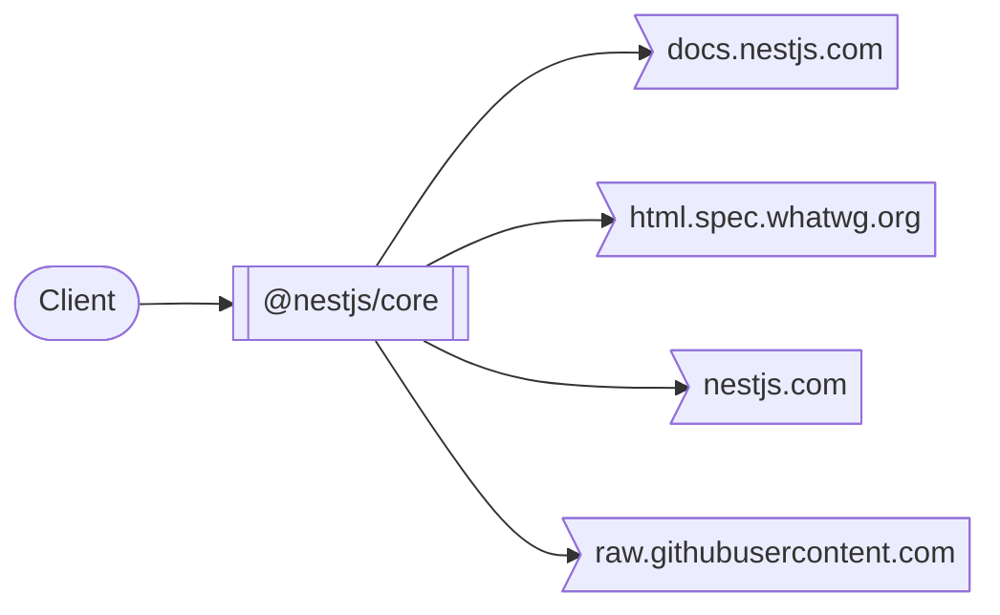
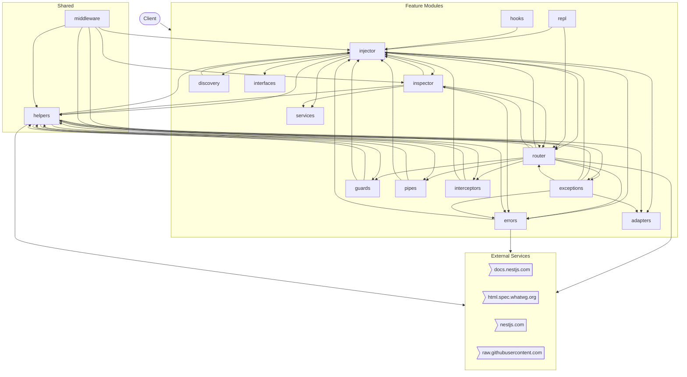
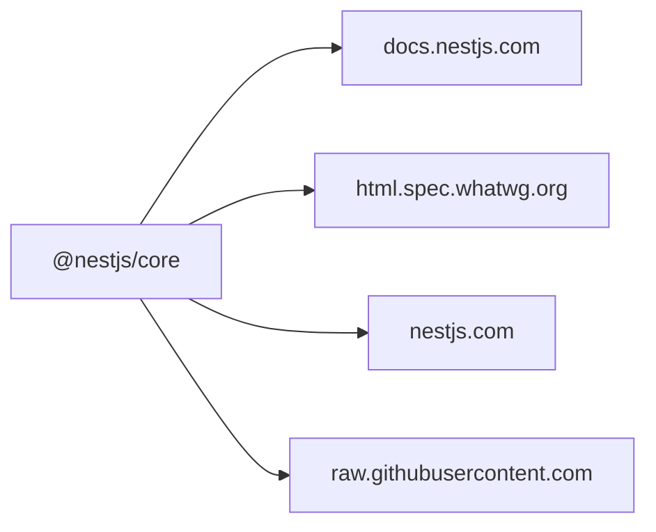

# @nestjs/core

> Nest - modern, fast, powerful node.js web framework (@core)

*Auto-generated by [zinsight](https://github.com/zinboard/zinsight) on YYYY-MM-DD*

## What This App Does

> Nest - modern, fast, powerful node.js web framework (@core)

**@Nestjs/Core** is a **backend API service** built with **NestJS**.

The codebase follows a **modular, controller-service, guard-protected** architecture — each feature is a self-contained module with clear separation between HTTP handling (controllers), business logic (services), and data access (schemas).

### Core Capabilities

- **Injector management**
- **Router management**
- **Errors management**
- **Repl management**
- **Inspector management**
- **(Root) management**
- **Middleware management**
- **Exceptions management**

In total, the system exposes **18** modules.


## Overview

| **179** files · **14,809** lines of code · **18** modules |
|---|

**Project docs:** [Description](README.md)

## At a Glance

A 60-second mental snapshot — what calls in, what we call out, where state lives.



## Core Concepts

Domain vocabulary used throughout the codebase. Read this first if names look unfamiliar.

| Term | Kind | What it means | Defined in |
|------|------|---------------|------------|
| **ReflectorService** | `service` | Service class — encapsulates business logic for one feature area. | `services/reflector.service.ts` |

## Where State Lives

Every persistence and caching surface in the system.

- **In-memory (per process)** — Per-process caches via Map/Set instance properties (19 files). Not shared across instances.
  - Sample files: `discovery/discoverable-meta-host-collection.ts`, `helpers/handler-metadata-storage.ts`, `injector/container.ts`, `injector/instance-links-host.ts`, `injector/instance-wrapper.ts`
- **Environment variables** — 1 environment variable drive runtime behaviour.

## External Contracts

Every connection to a system outside this repo — what we send, what we receive, how we authenticate.

| Service | Direction | We call | They call us | Auth |
|---------|-----------|---------|--------------|------|
| **docs.nestjs.com** | outbound | `HTTPS · docs.nestjs.com` | — | Unknown |
| **html.spec.whatwg.org** | outbound | `HTTPS · html.spec.whatwg.org` | — | Unknown |
| **nestjs.com** | outbound | `HTTPS · nestjs.com` | — | Unknown |
| **raw.githubusercontent.com** | outbound | `HTTPS · raw.githubusercontent.com` | — | Unknown |

## How to Get Productive

Pick a goal — read the listed files in order — be productive in minutes, not days.

### Understand the request lifecycle (15 min)

1. `index.ts` — Where the app boots and registers everything.
2. `errors/exceptions/invalid-middleware-configuration.exception.ts` — Wraps every request — sets req.auth or session.

## Where to Look

Common questions answered up front. If you want to change something, this tells you which files to open.

| If you want to change... | Look in |
|--------------------------|---------|
| **Authorization / Roles** — _Who can do what — guards, role checks, permissions._ | `guards/constants.ts`, `guards/guards-consumer.ts`, `guards/guards-context-creator.ts`, `guards/index.ts` |
| **Configuration / Environment** — _Where env vars are read and the server bootstraps._ | `hooks/on-app-bootstrap.hook.ts` |
| **Webhooks** — _Inbound POSTs from external services._ | `hooks/before-app-shutdown.hook.ts`, `hooks/on-app-bootstrap.hook.ts`, `hooks/on-app-shutdown.hook.ts`, `hooks/on-module-destroy.hook.ts`, `hooks/on-module-init.hook.ts` |
| **Caching** — _In-memory, Redis, or other caches._ | `inspector/interfaces/enhancer-metadata-cache-entry.interface.ts` |
| **Logging** — _Structured logs and log destinations._ | `injector/helpers/silent-logger.ts`, `repl/repl-logger.ts` |
| **Payments / Billing** — _Payment processing or subscription billing._ | `middleware/builder.ts`, `middleware/route-info-path-extractor.ts`, `router/route-path-factory.ts` |

## What This Repo Isn't

Stops you looking for things that don't exist here.

- **No frontend in this repo** — _No .tsx/.jsx files and no client/frontend/web/ui folder._
- **No background job queue** — _No bull/kafka/rabbitmq/sqs imports detected._
- **No file uploads** — _No multer/busboy/formidable/FileInterceptor usage detected._
- **No payment processing** — _No payment-provider integration detected._
- **Single-region deployment (no multi-region replication detected)** — _No explicit multi-region configuration found._

## Table of Contents

- [What This App Does](#what-this-app-does)
- [Overview](#overview)
- [At a Glance](#at-a-glance)
- [Core Concepts](#core-concepts)
- [Where State Lives](#where-state-lives)
- [External Contracts](#external-contracts)
- [How to Get Productive](#how-to-get-productive)
- [Where to Look](#where-to-look)
- [What This Repo Isn't](#what-this-repo-isnt)
- [Tech Stack](#tech-stack)
- [Architecture](#architecture)
- [Modules](#modules)
- [External Integrations](#external-integrations)
- [Environment Variables](#environment-variables)
- [Getting Started](#getting-started)
- [New Developer Guide](#new-developer-guide)

## Tech Stack

| Category | Technologies |
|----------|-------------|
| **Runtime** | Node.js |
| **Languages** | TypeScript |
| **Frameworks** | NestJS |
| **Other Notable** | RxJS |

## Architecture



## Modules

| Module | Purpose | Files | Lines |
|--------|---------|-------|-------|
| **injector** | Feature module — 30 files, 18 public exports. | 30 | 4,033 |
| **router** | Feature module — 26 files, 15 public exports. | 26 | 2,347 |
| **errors** | Feature module — 21 files, 13 public exports. | 21 | 488 |
| **helpers** | Feature module — 20 files, 16 public exports. | 20 | 1,080 |
| **repl** | Feature module — 16 files, 1 public export. | 16 | 576 |
| **inspector** | Feature module — 15 files, 7 public exports. | 15 | 661 |
| **middleware** | Feature module — 8 files, 4 public exports. | 8 | 1,063 |
| **exceptions** | Feature module — 7 files, 5 public exports. | 7 | 333 |
| **hooks** | Feature module — 6 files, 1 public export. | 6 | 361 |
| **discovery** | Feature module — 4 files, 2 public exports. | 4 | 338 |
| **guards** | Feature module — 4 files, 2 public exports. | 4 | 186 |
| **pipes** | Feature module — 4 files, 3 public exports. | 4 | 171 |
| **interceptors** | Feature module — 3 files, 3 public exports. | 3 | 189 |
| **adapters** | Feature module — 2 files, 2 public exports. | 2 | 196 |
| **interfaces** | Feature module — 2 files, 2 public exports. | 2 | 16 |
| **services** | Feature module — 2 files, 2 public exports. | 2 | 271 |

## External Integrations



| Service | Type | Methods | Files |
|---------|------|---------|-------|
| **docs.nestjs.com** | api | — | 3 file(s) |
| **html.spec.whatwg.org** | api | — | 1 file(s) |
| **nestjs.com** | api | — | 1 file(s) |
| **raw.githubusercontent.com** | api | — | 1 file(s) |

## Environment Variables

### Required vs Optional

**1 required** (no fallback) · **0 optional** (default present in code).

| Required Variable | Risk if missing |
|-------------------|-----------------|
| `NEST_DEBUG` | Unknown — depends on what this variable controls. |

| Variable | Used in |
|----------|---------|
| `NEST_DEBUG` | `injector/injector.ts`, `injector/instance-wrapper.ts` |

## Getting Started

### Prerequisites

- **Node.js** (check `.nvmrc` or `engines` in package.json for version)
- **npm** as package manager

### Installation

```bash
# Clone the repository
git clone <repository-url>
cd <project-directory>

# Install dependencies
npm install

# Set up environment variables
cp .env.example .env  # then fill in your values
```

## New Developer Guide

> Everything you need to get oriented in this codebase as a new team member.

### Project Structure

```
├── injector/               # Injector module (30 files, 4,033 loc)
├── router/                 # API controllers (26 files, 2,347 loc)
├── helpers/                # Helpers module (20 files, 1,080 loc)
├── middleware/             # Request middleware (8 files, 1,063 loc)
├── inspector/              # Inspector module (15 files, 661 loc)
├── repl/                   # Repl module (16 files, 576 loc)
├── errors/                 # Errors module (21 files, 488 loc)
├── hooks/                  # Hooks module (6 files, 361 loc)
├── discovery/              # Business logic / services (4 files, 338 loc)
├── exceptions/             # Exceptions module (7 files, 333 loc)
├── services/               # Business logic / services (2 files, 271 loc)
├── adapters/               # Adapters module (2 files, 196 loc)
├── interceptors/           # Interceptors module (3 files, 189 loc)
├── guards/                 # Route guards & access control (4 files, 186 loc)
├── pipes/                  # Pipes module (4 files, 171 loc)
└── interfaces/             # Interfaces module (2 files, 16 loc)
```

### Key Files

| # | File | Category | Lines | Why read this |
|---|------|----------|-------|---------------|
| 1 | `index.ts` | Entry Point | 25 | Application bootstrap — initializes 16 dependencies, sets up middleware, and starts the server. Start here to understand how the app is wired together |
| 2 | `application-config.ts` | Configuration | 151 | Configuration for application config — exports: ApplicationConfig |
| 3 | `guards/index.ts` | Security | 4 | Route guard applied across 3 files — controls which users can access which endpoints. Defines role-based access rules |
| 4 | `guards/constants.ts` | Security | 2 | Route guard applied across 2 files — controls which users can access which endpoints. Exports: FORBIDDEN_MESSAGE |
| 5 | `guards/guards-consumer.ts` | Security | 58 | Route guard applied across 1 files — controls which users can access which endpoints. Exports: GuardsConsumer |
| 6 | `repl/repl.interfaces.ts` | Type Definitions | 22 | Shared type contracts imported by 8 files — defines: ReplFnDefinition, ReplFunctionClass |
| 7 | `inspector/interfaces/entrypoint.interface.ts` | Type Definitions | 25 | Shared type contracts imported by 5 files — defines: HttpEntrypointMetadata, MiddlewareEntrypointMetadata, Entrypoint |
| 8 | `injector/opaque-key-factory/interfaces/module-opaque-key-factory.interface.ts` | Type Definitions | 27 | Shared type contracts imported by 4 files — defines: ModuleOpaqueKeyFactory |
| 9 | `services/reflector.service.ts` | Business Logic | 269 | Implements services business logic (269 lines) — consumed by 2 files, exports: CreateDecoratorOptions, ReflectableDecorator, Reflector |
| 10 | `discovery/discovery-service.ts` | Business Logic | 168 | Implements discovery business logic (168 lines) — consumed by 2 files, exports: FilterByInclude, FilterByMetadataKey, DiscoveryOptions, DiscoverableDecorator (+1 more) |
| 11 | `services/index.ts` | Business Logic | 2 | Implements services business logic (2 lines) — consumed by 2 files |
| 12 | `helpers/execution-context-host.ts` | Shared Utility | 66 | Shared helpers used by 8 files across the codebase — provides: ExecutionContextHost |

### Patterns

- **Guard-based Authorization** — Route access is controlled by guards that run before the handler. Check existing guards to understand the permission model before adding new endpoints.
- **Middleware Pipeline** — Requests pass through middleware before reaching handlers. Common uses: logging, auth session, request enrichment.
- **Barrel Exports** — 23 index files re-export module contents. Import from the directory (e.g., `from './feature'`) rather than individual files.

### Common Tasks

| If you want to... | Start here | Pattern to follow |
|-------------------|-----------|-------------------|
| Add auth to a route | `guards/constants.ts` | Add `@UseGuards()` decorator to the controller method |
| Integrate a new external API | `services/reflector.service.ts` | Create a service that wraps the API client, inject where needed |
| Add an environment variable | `application-config.ts` | Add to `.env`, reference via `process.env.VAR_NAME` or config service |
| Understand the startup flow | `index.ts` | Follow imports from main → app module → feature modules |

---

*Generated by [zinsight](https://github.com/zinboard/zinsight)*
